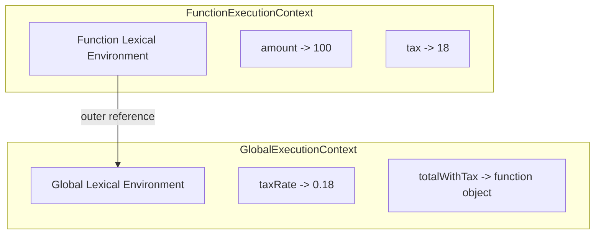
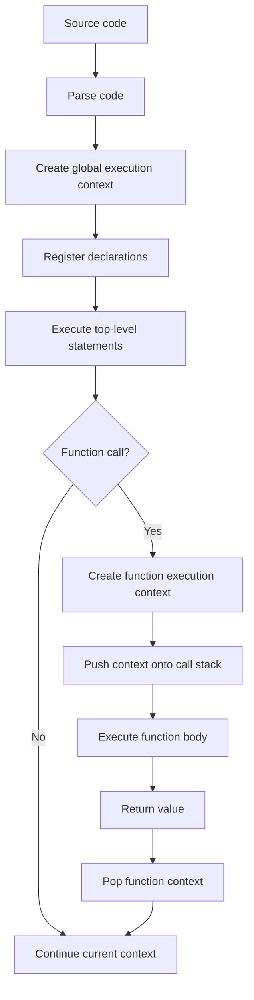

# Chapter 1: JavaScript Execution Model

## Introduction

JavaScript looks simple when it runs a few lines from top to bottom. The real language is more structured than that. Before JavaScript executes your code, the engine parses it, creates internal records for declarations, prepares memory for bindings, and then evaluates statements inside execution contexts.

This chapter gives you the mental model you will reuse throughout the book. When you understand execution contexts, lexical environments, the call stack, and host interaction, features like closures, hoisting, modules, promises, and `this` become easier to reason about.

## Learning Objectives

By the end of this chapter, you should be able to:

- Define the JavaScript execution model.
- Explain why execution contexts exist.
- Trace global and function execution step by step.
- Distinguish the creation phase from the execution phase.
- Describe the call stack and lexical environment.
- Predict simple hoisting behavior.
- Use diagrams to explain memory and scope.
- Answer interview questions about JavaScript runtime behavior.

## Prerequisites

You should be comfortable with:

- Basic JavaScript syntax.
- Variables declared with `let`, `const`, and `var`.
- Function declarations and function calls.
- Running a `.js` file with Node.js.

## Definition

The JavaScript execution model is the set of rules an engine follows to parse source code, create execution contexts, allocate bindings, maintain scope, call functions, return values, and interact with the host environment.

An execution context is an internal engine structure that represents code currently being evaluated. It contains references to the lexical environment, variable environment, `this` binding, and other specification-level state.

## Why It Exists

JavaScript needs a disciplined way to answer questions such as:

- Which variable does this identifier refer to?
- What happens when a function is called?
- Where should local variables live?
- What should happen after a function returns?
- How should nested functions remember outer variables?

Without execution contexts, scope and function calls would be ambiguous. The engine needs a precise model so the same program behaves consistently across environments.

## Problem It Solves

Consider this code:

```js
const taxRate = 0.18;

function totalWithTax(amount) {
  const tax = amount * taxRate;
  return amount + tax;
}

console.log(totalWithTax(100));
```

The engine must know that `amount` belongs to the function call, `taxRate` belongs to the outer scope, and `tax` should disappear after the function returns. The execution model solves this by creating a global execution context and a new function execution context for the call.

## Theory

JavaScript execution has two major phases:

1. Creation phase: the engine prepares the context, registers declarations, creates bindings, and determines scope relationships.
2. Execution phase: the engine evaluates statements, assigns values, calls functions, and produces results.

The exact specification machinery is more formal than this simplified teaching model, but the two-phase explanation is extremely useful in interviews.

## Internal Working

When JavaScript starts running a script, the engine creates a global execution context. When a function is called, the engine creates a function execution context and pushes it onto the call stack.

Each context contains:

- Lexical environment: stores `let`, `const`, function declarations, and references to outer environments.
- Variable environment: stores `var` declarations in script/function code.
- `this` binding: the value of `this` for the current context.
- Outer reference: a link to the parent lexical environment.

The outer reference is what makes scope chains possible.

## Memory Diagram



The function context stores local bindings. When it cannot find `taxRate` locally, it follows the outer reference to the global lexical environment.

## Flowchart



## Engine Internals

A modern engine such as V8 uses several stages:

1. Parse source code into an abstract syntax tree.
2. Build scope information from declarations.
3. Generate bytecode for an interpreter.
4. Execute bytecode while collecting runtime feedback.
5. Optimize hot paths with a just-in-time compiler.
6. Deoptimize when runtime assumptions become invalid.

At the language level, you do not manually control these stages. As an engineer, you should understand that predictable code gives the engine better optimization opportunities.

## Execution Steps

For the earlier `totalWithTax` example, execution proceeds like this:

1. Create the global execution context.
2. Create a binding for `taxRate`.
3. Create a binding for `totalWithTax`.
4. Assign `0.18` to `taxRate`.
5. Store the function object in `totalWithTax`.
6. Evaluate `console.log(totalWithTax(100))`.
7. Create a function execution context for `totalWithTax`.
8. Bind `amount` to `100`.
9. Evaluate `amount * taxRate`.
10. Resolve `amount` locally.
11. Resolve `taxRate` through the outer environment.
12. Bind `tax` to `18`.
13. Return `118`.
14. Pop the function execution context.
15. Pass `118` to `console.log`.

## Production Example

In production code, execution context reasoning helps you avoid hidden shared state.

```js
function createInvoiceCalculator({ taxRate, discountRate }) {
  return function calculateInvoiceTotal(items) {
    const subtotal = items.reduce((sum, item) => sum + item.price * item.quantity, 0);
    const discount = subtotal * discountRate;
    const taxableAmount = subtotal - discount;
    const tax = taxableAmount * taxRate;

    return {
      subtotal,
      discount,
      tax,
      total: taxableAmount + tax
    };
  };
}
```

The returned function keeps access to `taxRate` and `discountRate` through its outer lexical environment. This is the foundation of closures, which are covered deeply in Volume 2.

See `code/chapter-01/example-01-execution-context.js` for a runnable version.

## Interview Explanation

A strong interview answer:

> JavaScript executes code inside execution contexts. The engine creates a global context first. Each function call creates a new function execution context, which is pushed onto the call stack. A context contains lexical bindings, variable bindings, a `this` binding, and a reference to the outer lexical environment. Identifier lookup starts in the current environment and walks outward through the scope chain.

Then add a quick example:

```js
const currency = 'USD';

function label(amount) {
  return `${currency} ${amount}`;
}
```

`amount` is local to the function context. `currency` is resolved through the outer lexical environment.

## Common Mistakes

- Thinking JavaScript simply reads files line by line without a creation phase.
- Saying all declarations are hoisted in the same way.
- Believing local variables remain available after a normal function returns.
- Confusing the call stack with the event loop.
- Treating lexical scope and dynamic call location as the same thing.

## Edge Cases

### `var` Binding

`var` is function-scoped, not block-scoped.

```js
function countOrders(orders) {
  if (orders.length > 0) {
    var status = 'ready';
  }

  return status;
}
```

The `status` binding belongs to the function environment, so the return statement can access it. With `let`, the binding would belong to the `if` block.

### Temporal Dead Zone

`let` and `const` bindings are known during creation, but cannot be accessed before initialization.

```js
console.log(total);
const total = 42;
```

This throws a `ReferenceError`. The binding exists, but it is uninitialized.

## Performance Notes

Execution context creation is normal and fast, but unnecessary function churn can matter in hot paths. Avoid creating new functions inside tight loops unless the function needs fresh lexical state.

Predictable object shapes, stable function usage, and limited mutation help engines optimize. Performance work should be guided by profiling, not guesses.

## Security Notes

Avoid `eval` and dynamically constructed functions. They make scope analysis harder, can expose sensitive bindings, and often prevent optimizations.

Do not rely on global variables for security-sensitive state. Global state is easier to overwrite, inspect, or misuse across modules.

## Best Practices

- Prefer `const` by default and `let` when reassignment is necessary.
- Keep functions small enough that their local execution context is easy to reason about.
- Avoid accidental globals.
- Use modules to limit top-level scope.
- Explain scope using lexical location, not call location.
- Treat runtime diagrams as reasoning tools, not decoration.

## When Not to Use This Mental Model Too Literally

The creation/execution phase model is a teaching model. It maps well to observable behavior, but engines use sophisticated internal representations. In interviews, use it to explain behavior clearly, then acknowledge that actual engines optimize heavily.

## Hands-on Exercises

### Easy

Trace the output:

```js
const region = 'APAC';

function formatUser(id) {
  const prefix = 'user';
  return `${region}:${prefix}:${id}`;
}

console.log(formatUser(7));
```

Hint: identify which bindings are global and which are function-local.

### Medium

Rewrite this function to avoid accidental shared mutable state:

```js
const auditEvents = [];

function recordAuditEvent(event) {
  auditEvents.push(event);
  return auditEvents;
}
```

Hint: return a function that owns its own lexical environment.

### Hard

Explain why this fails:

```js
function run() {
  console.log(orderId);
  const orderId = 'A-100';
}

run();
```

Hint: discuss the temporal dead zone.

### FAANG

Design a small function factory for pricing rules. It should accept configuration once and return a pure function that calculates totals for many carts.

Requirements:

- No global mutable state.
- Clear input validation.
- Deterministic output.
- Explain which variables live in which lexical environment.

## Coding Challenges

1. Build `createCounter(start)` that returns `increment`, `decrement`, and `value` functions.
2. Build `createRateLimiter(limit)` that tracks call count in a closure.
3. Build `createFormatter(locale, currency)` that returns a currency formatting function.

## Solutions

### Easy Solution

The output is:

```text
APAC:user:7
```

`region` is resolved from the global lexical environment. `id` and `prefix` are resolved from the function execution context.

### Medium Solution

```js
function createAuditRecorder() {
  const auditEvents = [];

  return function recordAuditEvent(event) {
    auditEvents.push({ ...event, recordedAt: new Date().toISOString() });
    return [...auditEvents];
  };
}
```

Complexity: each call is `O(n)` time and space because it returns a copy of all events. Returning a copy protects internal state from external mutation.

Alternative: persist each event to a database or stream and return only the created record.

### Hard Solution

The function throws a `ReferenceError` because `orderId` is a `const` binding. The binding is created when the function context is prepared, but it is not initialized until execution reaches the declaration. The region before initialization is the temporal dead zone.

### FAANG Solution

```js
function createPricingRule({ taxRate, discountRate }) {
  if (taxRate < 0 || discountRate < 0 || discountRate > 1) {
    throw new RangeError('Invalid pricing configuration.');
  }

  return function priceCart(items) {
    const subtotal = items.reduce((sum, item) => sum + item.price * item.quantity, 0);
    const discount = subtotal * discountRate;
    const taxableAmount = subtotal - discount;
    const tax = taxableAmount * taxRate;

    return {
      subtotal,
      discount,
      tax,
      total: taxableAmount + tax
    };
  };
}
```

`taxRate` and `discountRate` live in the outer lexical environment created by `createPricingRule`. `items`, `subtotal`, `discount`, `taxableAmount`, and `tax` live in each call to `priceCart`.

## MCQs

1. What is created when a function is called?
   - A. A new JavaScript engine
   - B. A new function execution context
   - C. A new source file
   - D. A new browser tab

   Answer: B.

2. Where does identifier lookup start?
   - A. The global object
   - B. The current lexical environment
   - C. The nearest module file
   - D. The package manager

   Answer: B.

3. What happens when code accesses a `const` binding before initialization?
   - A. It returns `undefined`
   - B. It returns `null`
   - C. It throws a `ReferenceError`
   - D. It creates a global variable

   Answer: C.

## Revision Sheet

- JavaScript runs code inside execution contexts.
- The global context is created first.
- Every function call creates a function execution context.
- The call stack tracks active execution contexts.
- Lexical environments store bindings and outer references.
- Identifier lookup starts locally and walks outward.
- `var` is function-scoped.
- `let` and `const` are block-scoped and have a temporal dead zone.
- Closures rely on preserved lexical environments.

## Summary

The execution model is the foundation for serious JavaScript reasoning. It explains how code is prepared, how functions run, how variables are resolved, and why scope behaves the way it does. Master this chapter before moving to closures, promises, modules, and browser internals.

## References

- ECMAScript Language Specification, Execution Contexts.
- MDN Web Docs, JavaScript Guide.
- V8 documentation on parsing, bytecode, and optimization.

## Further Reading

- Volume 2: Lexical Scope and Closures.
- Volume 3: Microtasks and Macrotasks.
- Appendix: Glossary.

