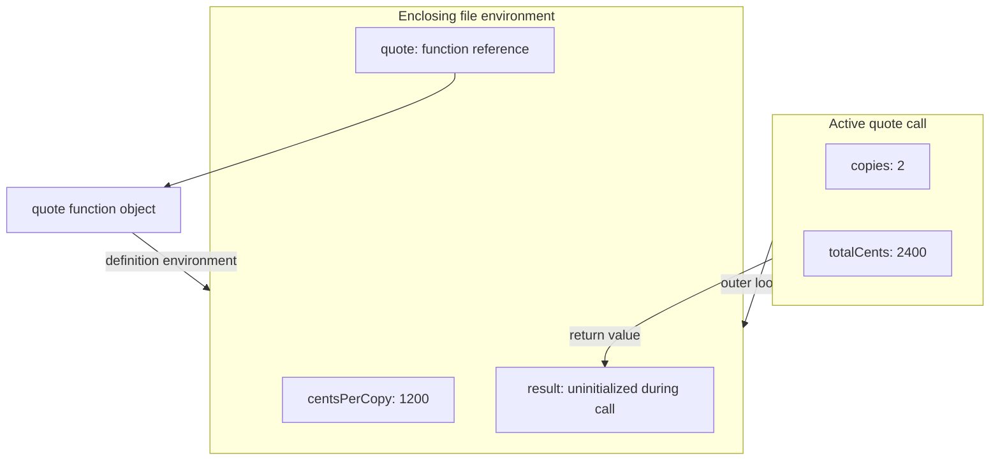
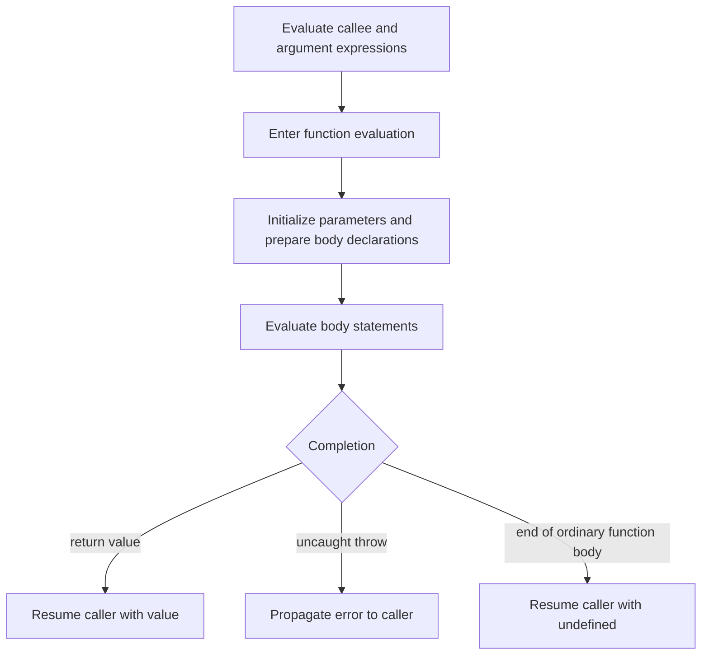

# JavaScript Execution Model: A Companion

This companion revisits the introduction after [Variables and Data Types](chapter-02/01-introduction.md) and [Functions and Callbacks](chapter-07/01-introduction.md). Its stable URL also serves readers entering Volume 2. It develops execution contexts and lexical environments; it does not replace the main Chapter 1 reading sequence.

The assertion programs in `code/chapter-01` exercise call initialization, call-stack order, lexical lookup, and the owned audit recorder. Run them with the repository's `npm run examples:test` command.

## Objectives and Prerequisites

Know declarations, function calls, parameters, return values, and basic object/array syntax. Run the independent examples in Node.js 20 or later. By the end, distinguish a binding from a call frame, resolve an identifier from its definition environment, trace initialization order, and explain why a returned array copy may still expose internal records.

## Execution Contexts Are a Semantic Model

An execution context tracks the evaluation of code, including its lexical environment and other specification state. An environment record associates names with bindings and can link to an outer environment. These concepts define behavior; engines do not have to allocate a literal heap object for every box drawn in a teaching diagram. See [ECMAScript execution contexts and environment records](https://tc39.es/ecma262/multipage/executable-code-and-execution-contexts.html).

The call stack answers which synchronous computation resumes when a call returns. Lexical lookup answers which binding an identifier denotes. These are different questions: a function does not generally obtain free variables from whichever function happens to call it.

Top-level code also depends on execution mode. A classic script, an ECMAScript module, and a Node CommonJS file do not have identical top-level binding behavior. This companion uses CommonJS-compatible files and avoids relying on top-level `this` or global-object properties.

## Trace a Call

```js
'use strict';

const centsPerCopy = 1200;
function quote(copies) {
  const totalCents = copies * centsPerCopy;
  return totalCents;
}
const result = quote(2);
console.log(result);

// Expected output:
// 2400
```

Before the surrounding statements run, declaration instantiation makes the function declaration callable. The lexical bindings for `centsPerCopy` and `result` initially remain uninitialized. Evaluating the first declaration initializes `centsPerCopy` to 1200. Calling `quote` supplies 2 to the parameter `copies`. The function resolves `centsPerCopy` from its enclosing environment, computes 2400, initializes its local `totalCents`, and returns that value. Only then is `result` initialized.

Calling this "creation, then execution" can be a useful simplification. It is not a claim that source lines move or that all declarations receive undefined. Different declaration forms have different initialization rules.

## Memory and Lookup Diagram


```mermaid
flowchart TB
  subgraph Enclosing["Enclosing file environment"]
    Price["centsPerCopy: 1200"]
    Quote["quote: function reference"]
    Result["result: uninitialized during call"]
  end
  Quote --> Function["quote function object"]
  Function -->|definition environment| Enclosing
  subgraph Active["Active quote call"]
    Copies["copies: 2"]
    Total["totalCents: 2400"]
  end
  Active -->|outer lookup| Enclosing
  Active -->|return value| Result
```

Source: `diagrams/volume-1-chapter-01-companion-memory.mmd`. This is a semantic snapshot immediately before the return; it makes no claim about physical stack or heap allocation.

## Call and Return Flow


```mermaid
flowchart TD
  Caller["Evaluate callee and argument expressions"] --> Enter["Enter function evaluation"]
  Enter --> Bind["Initialize parameters and prepare body declarations"]
  Bind --> Body["Evaluate body statements"]
  Body --> Outcome{"Completion"}
  Outcome -->|return value| Resume["Resume caller with value"]
  Outcome -->|uncaught throw| Propagate["Propagate error to caller"]
  Outcome -->|end of ordinary function body| Undefined["Resume caller with undefined"]
```

Source: `diagrams/volume-1-chapter-01-companion-flow.mmd`. This diagram covers ordinary synchronous functions. Generators and asynchronous functions add suspension and completion behavior developed later.

## Definition Location Wins Over Call Location

```js
'use strict';

const region = 'APAC';
function label(id) {
  return `${region}:${id}`;
}
function runInAnotherScope() {
  const region = 'EU';
  return label('A-7');
}
console.log(runInAnotherScope());

// Expected output:
// APAC:A-7
```

The local `region` inside `runInAnotherScope` does not become an outer environment of `label`. The called function retains the lexical relationship established where it was created. A debugger's caller frame is not an extra lexical scope for the callee.

## A Returned Function Retains a Binding

```js
'use strict';

function createCounter(start) {
  if (!Number.isSafeInteger(start) || start < 0 || start >= 1000) {
    throw new RangeError('start must be an integer from 0 through 999');
  }
  let count = start;
  return function next() {
    if (count === 1000) throw new RangeError('counter limit reached');
    count += 1;
    return count;
  };
}
const first = createCounter(3);
const second = createCounter(10);
console.log(first(), first(), second());

// Expected output:
// 4 5 11
```

Each factory call creates its own `count` binding. Returning does not make that reachable state vanish: `first` and `second` retain access to separate environments. The active factory calls have finished, but their bindings remain useful to the returned functions. This distinction is the foundation of [lexical scope and closures](../volume-2/chapter-01/01-introduction.md).

## Initialization Errors Are About Timing

```js
'use strict';

function readTooSoon() {
  return total;
  const total = 42;
}
try {
  readTooSoon();
} catch (error) {
  console.log(error.name);
}
function readAfterInitialization() {
  function read() { return total; }
  const total = 42;
  return read();
}
console.log(readAfterInitialization());

// Expected output:
// ReferenceError
// 42
```

The first function's declaration still creates the lexical binding even though its initializer is never reached. Reading it throws. In the second function the nested function is defined before `total`, but called after initialization. Textual position alone does not determine whether a read occurs in the temporal dead zone.

## Production Exercise: An Audit Recorder With Owned Records

**Requirements:** Create an isolated recorder per request or workflow. Accept ordinary data records with nonempty string `id` and `action` fields. Copy only those primitive fields into internal storage. Return a history whose array and entry objects can be changed by the caller without affecting later results. No clocks, global state, or nested-data ownership claims are allowed in this contract.

**Solution:** Copy the record on ingress and copy each retained record on egress. A new outer array alone is insufficient.

```js
'use strict';
const assert = require('node:assert/strict');

function createAuditRecorder() {
  const entries = [];
  return function record(event) {
    if (event === null || typeof event !== 'object' || Array.isArray(event)) {
      throw new TypeError('event object required');
    }
    const { id, action } = event;
    if (typeof id !== 'string' || id.trim() === '' ||
        typeof action !== 'string' || action.trim() === '') {
      throw new TypeError('nonempty id and action required');
    }
    entries.push({ id: id.trim(), action: action.trim() });
    return entries.map(entry => ({ id: entry.id, action: entry.action }));
  };
}
const record = createAuditRecorder();
const input = { id: 'A-1', action: 'created' };
const snapshot = record(input);
input.action = 'tampered';
snapshot[0].id = 'changed';
snapshot.push({ id: 'injected', action: 'fake' });
const next = record({ id: 'A-2', action: 'approved' });
assert.deepEqual(next, [
  { id: 'A-1', action: 'created' },
  { id: 'A-2', action: 'approved' }
]);
assert.throws(() => record({ id: 'A-3', action: {} }), TypeError);
assert.equal(createAuditRecorder()({ id: 'B-1', action: 'created' }).length, 1);
console.log(next.map(entry => `${entry.id}:${entry.action}`).join('|'));

// Expected output:
// A-1:created|A-2:approved
```

After `n` retained events, producing a complete history takes O(n) record-copy work plus the relevant string processing. The recorder keeps O(n) records; the returned history also contains O(n) records. Repeated full snapshots after each event incur quadratic cumulative record-copy work. For a long-lived audit log, append to durable storage and return one accepted record or a paginated query instead.

This implementation deliberately retains only primitive strings. If the schema later includes an object-valued `details`, decide who owns that graph. Adding `{ ...event }` would make only a shallow copy and would reintroduce shared nested state. The [object ownership chapter](chapter-08/01-introduction.md) develops that contract.

## Debugging, Performance, and Security

When a free identifier has an unexpected value, inspect where its function was defined and the binding's current value, not just the immediate caller. When data changes after a function returns, inspect aliases to the object as well as retained closures. A stack frame finishing is not evidence that every value it touched has become unreachable.

A retained callback can keep a large graph reachable through its enclosing state. Garbage collection reclaims unreachable data at an implementation-chosen time; it does not impose an application retention policy. Keep histories bounded and release references when the owning feature is finished.

A closure limits ordinary access paths but is not a complete security boundary. Returning a mutable internal record grants an access path to that record. Likewise, exposing a method capable of writing arbitrary paths grants that capability even if its implementation is hidden in a closure. Validate and restrict the operations you expose.

V8's [Ignition documentation](https://v8.dev/docs/ignition) describes one execution tier. Do not infer a fixed physical allocation or a guaranteed optimization from this chapter's semantic diagrams. Measure a real workload before rewriting clear function boundaries for speculative engine gains.

## Interview Answer and Revision

An ordinary call evaluates the callee and arguments, enters function evaluation with parameter bindings, runs the body, and resumes its caller with a return value or propagated error. Identifier lookup follows lexical environment relationships. Returned functions can retain access to bindings after the creating call finishes. Copying a container does not automatically copy its elements.

Practice by drawing the two separate counter environments and by changing only one snapshot record in the audit example. Explain which bindings change, which objects are shared, and why the next history remains intact after the fix.

## References and Further Reading

- [ECMAScript environment records](https://tc39.es/ecma262/multipage/executable-code-and-execution-contexts.html#sec-environment-records): formal binding operations and outer environments.
- [ECMAScript function calls](https://tc39.es/ecma262/multipage/ordinary-and-exotic-objects-behaviours.html#sec-ecmascript-function-objects-call-thisargument-argumentslist): ordinary function call semantics.
- [MDN closures](https://developer.mozilla.org/en-US/docs/Web/JavaScript/Guide/Closures): lexical retention with practical examples.
- [MDN memory management](https://developer.mozilla.org/en-US/docs/Web/JavaScript/Guide/Memory_management): reachability and collection limits.
- [Volume 2: Lexical Scope and Closures](../volume-2/chapter-01/01-introduction.md): deeper lifetime, loop-binding, and callback behavior.
