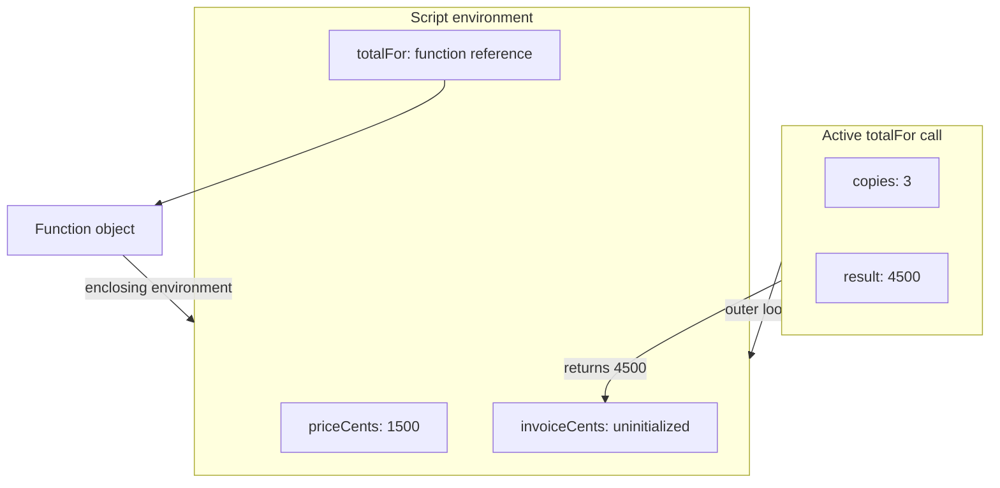
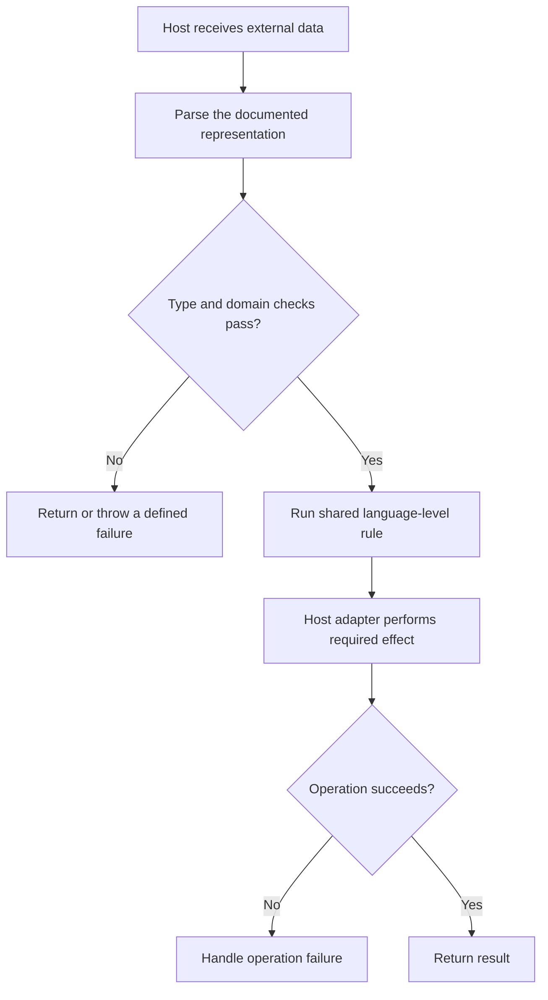

# Internal Working

## From Source Text to Observable Behavior

A host obtains source and asks an engine to evaluate it in a particular mode. Parsing checks syntax. Declaration instantiation prepares the relevant bindings. Evaluation performs operations, calls functions, and interacts with the host. These are language-level distinctions; an engine can combine or optimize implementation steps while preserving their observable result.

V8's [Ignition documentation](https://v8.dev/docs/ignition) describes its bytecode interpreter. Other tiers and optimizations can act on executed code. Do not draw "every line is first interpreted and then compiled" as a universal language rule. Engines can defer work, compile at different times, or remove work that cannot affect observations.

## A Concrete Execution Trace

```js
'use strict';

const priceCents = 1500;
function totalFor(copies) {
  const result = copies * priceCents;
  return result;
}
const invoiceCents = totalFor(3);
console.log(invoiceCents);

// Expected output:
// 4500
```

The important steps are:

1. Parse the script and prepare its declarations. The function declaration is initialized with its function object before top-level statement evaluation.
2. Evaluate the `priceCents` initializer, initializing its lexical binding to 1500.
3. Evaluate the call expression `totalFor(3)`. The function object is obtained and the argument value is supplied.
4. Enter the function call with `copies` equal to 3. Resolve `priceCents` from the function's enclosing environment.
5. Multiply, initialize `result`, and return 4500.
6. Initialize `invoiceCents` with that returned value and ask the host's console to print it.

A function declaration's source position is not the moment at which its function object must first become callable. Chapter 2 develops declaration initialization and the temporal dead zone.

## Semantic Memory Diagram

The diagram represents bindings and references while `totalFor` is executing. It does not assert physical stack addresses, object sizes, or that the engine must allocate every drawn box.



Source: `diagrams/volume-1-chapter-01-memory.mmd`.

The active call finishes before `invoiceCents` receives its value. The returned number does not require the call's local binding to remain accessible. A returned function could retain access to an enclosing binding; that is developed in the [execution-model companion](../chapter-01-execution-model.md).

## Flow Through an Application Boundary



Source: `diagrams/volume-1-chapter-01-boundary-flow.mmd`.

This is separate from the engine pipeline. A runtime can successfully execute code whose application input is invalid; parsing JavaScript source and parsing application data solve different problems.

## What Engines May Optimize

An engine may represent a small integer differently from a large number, avoid an unobservable allocation, inline a call, or change compiled code after observed assumptions stop holding. Those are implementation choices. "There is a function execution context" is a specification model; it does not promise a corresponding heap object or a physical machine-stack frame in every optimized execution.

Use the model to predict values, scope, and ordering. Measure actual execution when latency or memory matters. A guessed engine layout is not a reason to replace clear validated code with opaque tricks.

## The Host Still Matters

A CPU-bound loop occupies its executing thread. In a browser page that can delay UI work; in a Node service it can delay unrelated callbacks on the same event loop. Host APIs can initiate asynchronous operations, but wrapping expensive synchronous work in a function does not make it asynchronous. The later asynchronous volume explains scheduling; this chapter's responsibility is to keep the calculation and the host operation distinct.
