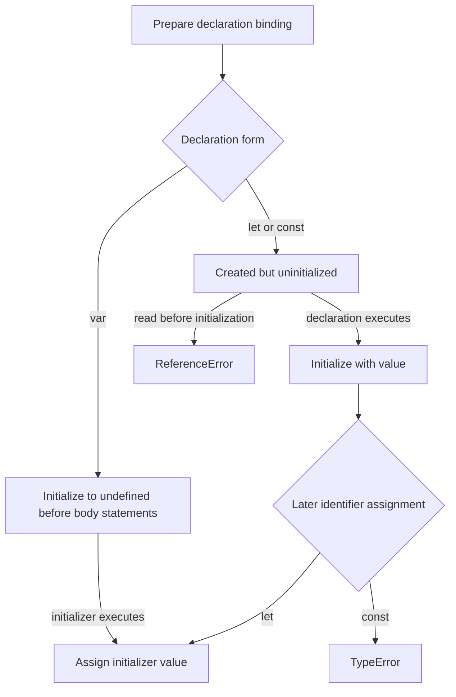
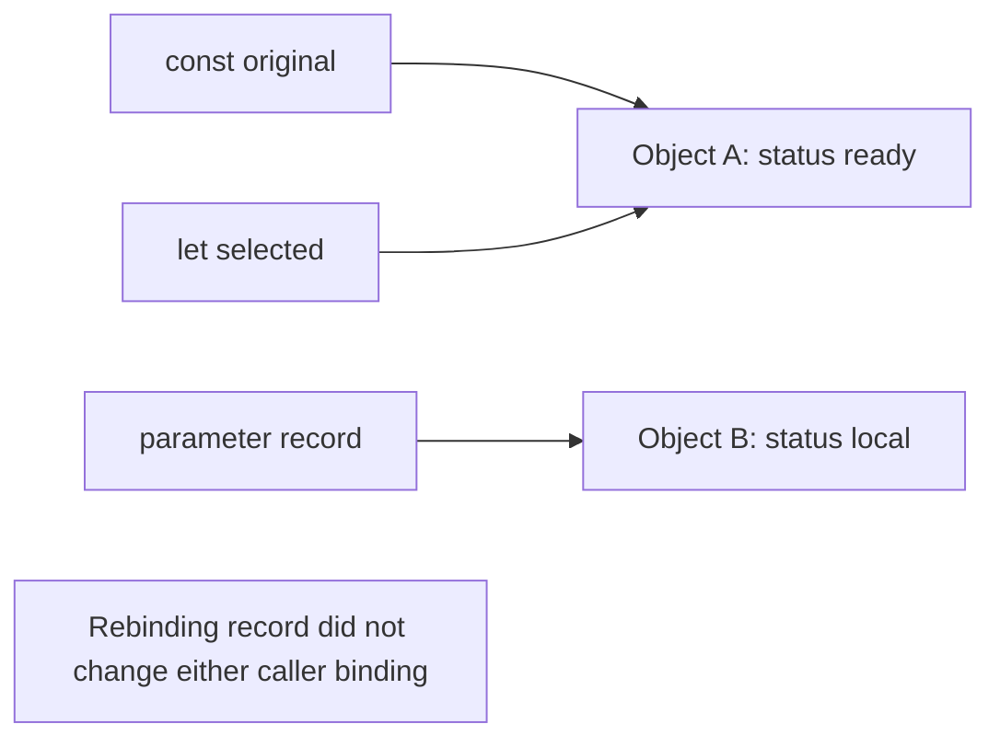

# Internal Working

## Trace the Binding Lifecycle

Consider a function containing `var legacy = 1`, `let current = 2`, and `const fixed = 3`. Before evaluating those body statements, the ordinary `var` binding is initialized to `undefined`. The lexical declarations are present but uninitialized. Evaluating their declarations initializes them in statement order. A later assignment can change `legacy` or `current`; changing `fixed` throws.

The lexical environment determines which binding an identifier denotes. The declaration form and lifecycle determine which operations are allowed on that binding. A value of `undefined` is an initialized state, not a synonym for "no binding."



Source: `diagrams/volume-1-chapter-02-binding-lifecycle.mmd`. This diagram describes ordinary declarations; imports and loop declarations have additional rules.

## Trace a Shared Record

```js
'use strict';

const original = { status: 'queued' };
let selected = original;
function mark(record) {
  record.status = 'ready';
  record = { status: 'local' };
  return record.status;
}
console.log(mark(selected));
console.log(original.status, selected === original);
selected = { status: 'replacement' };
console.log(original.status, selected.status);

// Expected output:
// local
// ready true
// ready replacement
```

1. Evaluate the first object literal, creating object A; initialize `original` with its identity.
2. Read `original` and initialize `selected` with the same identity. No object clone occurs.
3. Call `mark` with that value; initialize parameter `record` with object A.
4. Assign `record.status`, changing object A to contain `ready`.
5. Create object B and reassign the parameter to B. The caller's bindings still designate A.
6. Return B's `status` value, `local`. The parameter's reassignment does not escape as a binding change.
7. Create object C and reassign `selected`. `original` still designates A.

## Semantic Memory Diagram

The snapshot is taken inside `mark`, after step 5 and before the return:



Source: `diagrams/volume-1-chapter-02-object-aliases.mmd`. An arrow means that a binding designates an object identity; it does not promise an exposed memory address. After the final replacement, `selected` would point to a third object.

## Primitive Assignment Has No Mutable Object to Share

```js
'use strict';

let pending = 4;
const snapshot = pending;
pending = 5;
console.log(snapshot, pending);

// Expected output:
// 4 5
```

The second binding receives the Number value 4. Assigning 5 to `pending` does not change that earlier primitive value. No distinction between "deep" and "shallow" copying is necessary for these immutable Number values.

## Engine Internals: Semantics Before Storage

Environment records are specification machinery for resolving and updating bindings. Engines may represent locals in registers, stack slots, retained environment structures, or optimized forms. A compiler can remove a binding that has no observable role. Neither `const` nor `let` forces a specific physical storage location.

Likewise, the diagram's object B may become unreachable once the call finishes, but the language does not require an immediate collection. The retained reference from `original` keeps A available independently of whether `selected` changes. For a leak investigation, follow the retaining path rather than counting how many functions have returned.

Read [ECMAScript environment records](https://tc39.es/ecma262/multipage/executable-code-and-execution-contexts.html#sec-environment-records) for the formal binding model. The [execution-model companion](../chapter-01-execution-model.md) extends this trace to returned functions after the function fundamentals chapter.
