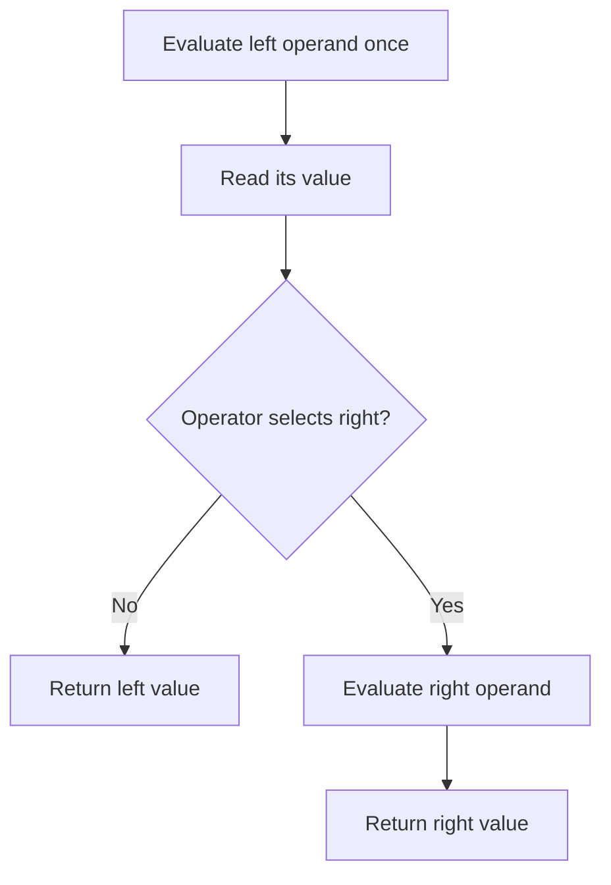
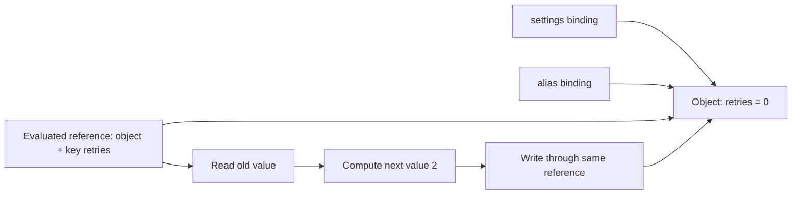

# Internal Working

## From Syntax to Observable Operations

The parser builds a representation of grouping; it does not run application calls while deciding precedence. Execution then visits the required operands, obtains their values, and applies the relevant operation. An engine may compile or optimize this work, but it must preserve observable calls, reads, writes, and errors.

Consider `left() + middle() * right()`. The observable trace is: call left; call middle; call right; multiply the last two returned values; add the first. If middle throws, right is never called. If the outer operator were a short-circuiting operator, an entire right subtree could be skipped.

## Short-Circuit Flow

Stored source: `diagrams/volume-1-chapter-03-short-circuit.mmd`.



The decision depends on the operator: truthiness for AND/OR, nullishness for coalescing. A skipped subtree contributes neither its return value nor its effects. This is why a fallback function can allocate only when needed.

```js
const events = [];
function step(label, value) { events.push(label); return value; }
const result = step('configured', 0) ?? step('default', 3);
console.log(result);
console.log(events.join(','));
events.length = 0;
const access = step('enabled', false) && step('permission', true);
console.log(access);
console.log(events.join(','));

// Expected output:
// 0
// configured
// false
// enabled
```

## Assignment References and Memory

Stored source: `diagrams/volume-1-chapter-03-assignment-memory.mmd`.



A property assignment changes the shared object, so every alias observes the new property. It does not rebind each alias. A local variable that previously copied a primitive property value keeps that old primitive.

```js
const settings = { retries: 0 };
const alias = settings;
const previous = settings.retries;
settings.retries += 2;
console.log(alias.retries);
console.log(previous);
console.log(alias === settings);

// Expected output:
// 2
// 0
// true
```

These are semantic references, not a promise about physical stack or heap addresses. Engines may optimize temporary values away while preserving the same behavior.

## Getters and Setters Make the Trace Visible

```js
const trace = [];
let stored = 0;
const config = {
  get retries() { trace.push('get'); return stored; },
  set retries(value) { trace.push('set ' + value); stored = value; }
};
config.retries ??= 3;
console.log(trace.join(','));
trace.length = 0;
config.retries ||= 3;
console.log(trace.join(','));
console.log(stored);

// Expected output:
// get
// get,set 3
// 3
```

The first operation reads zero, judges it present, and performs no write. The second reads zero, judges it falsy, evaluates three, and invokes the setter. Rewriting `config.retries ??= 3` as `config.retries = config.retries ?? 3` would always invoke the setter after the read. Similar-looking source can have different effects.

## Engine and Performance Perspective

Fast numeric paths depend on the actual operand values. A reusable addition site receiving both strings and numbers must still concatenate on one call and add on another. Optimization does not change the language into a statically typed system.

Do not infer a specific optimization tier, machine instruction, or object allocation from a small example. Measure a realistic workload with its input distribution. Expensive work is often inside an operand: a search, getter, allocation, or network adapter. Short-circuiting can avoid that work, but changing operand order is valid only if required effects and errors stay correct.

## Execution Checklist

For a difficult expression, write four columns: grouped expression, next operand, value/type, and effect. Mark skipped operands explicitly. For an assignment, additionally record the evaluated destination. For an exception, stop the trace at the throwing operation. This method works in browsers and Node because these operator rules belong to ECMAScript; host-specific functions called by the operands may differ.

Consult [the specification's expression evaluation algorithms](https://tc39.es/ecma262/multipage/ecmascript-language-expressions.html) when an observable ordering question remains unclear. The [edge cases](09-edge-cases-debugging.md) apply this trace method to common failures.
