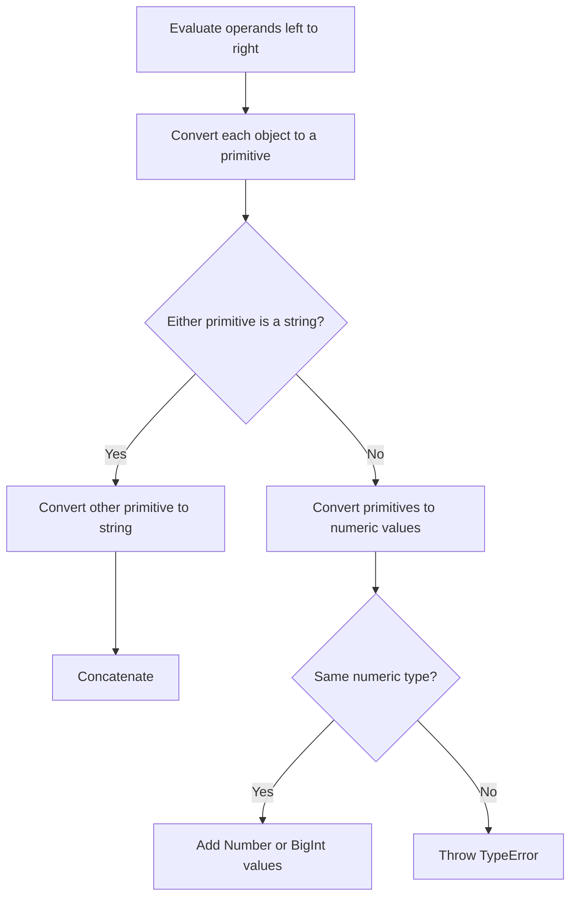
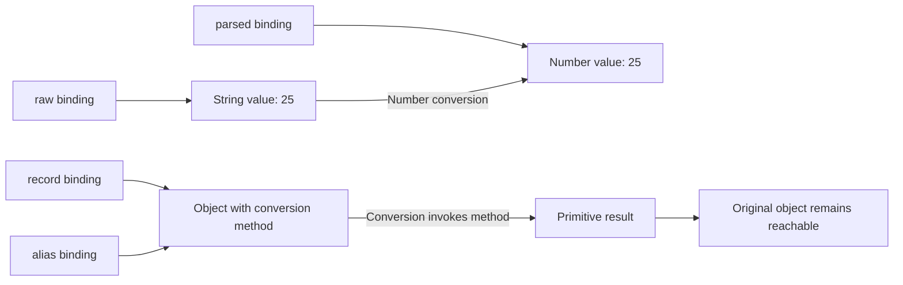

# Internal Working

## Trace Values Before Selecting the Operation

For `invoice + ' USD'`, the engine first evaluates the operands and obtains their values. It then requests primitive values, using the default hint for an object. After conversion, a string operand selects concatenation. Conversion methods may throw or change state before the final operation happens.

Stored source: `diagrams/volume-1-chapter-04-addition-flow.mmd`.



This models binary +. It is not the algorithm for Boolean conversion, subtraction, or every comparison. A Symbol primitive reaches string conversion in the concatenation branch and throws; a Number/BigInt pair reaches the mismatched numeric-types branch and throws.

## A Visible Conversion Trace

```js
const events = [];
const left = {
  [Symbol.toPrimitive](hint) { events.push('left:' + hint); return 4; }
};
const right = {
  [Symbol.toPrimitive](hint) { events.push('right:' + hint); return '5'; }
};
console.log(left + right);
console.log(events.join(','));

// Expected output:
// 45
// left:default,right:default
```

Both primitives are obtained before + chooses concatenation. The number 4 then becomes "4", and the result is "45". If the left conversion throws, the right conversion does not run. Evaluating the right operand expression and invoking its conversion method are separate steps: both operand expressions are evaluated before + requests primitive conversions.

## Fallback Conversion Order

```js
const events = [];
const amount = {
  valueOf() { events.push('valueOf'); return this; },
  toString() { events.push('toString'); return '25'; }
};
console.log(Number(amount));
console.log(events.join(','));
events.length = 0;
console.log(String(amount));
console.log(events.join(','));

// Expected output:
// 25
// valueOf,toString
// 25
// toString
```

Number conversion tries valueOf, receives an object, and tries toString. String conversion reverses the order and stops as soon as it receives a primitive. A primitive of the wrong eventual numeric meaning can still become NaN; the conversion method's success does not validate a business quantity. If neither method returns a primitive, conversion throws TypeError.

## Bindings, Values, and Object Identity

Stored source: `diagrams/volume-1-chapter-04-conversion-memory.mmd`.



The diagram represents semantic values and references, not fixed physical stack/heap locations. Primitive conversion derives a result; it does not replace the source binding or mutate an object automatically. User-defined conversion methods can still mutate shared objects.

```js
const raw = '25';
const parsed = Number(raw);
const record = { count: 0, valueOf() { this.count += 1; return 25; } };
const alias = record;
const normalized = Number(record);
console.log(typeof raw, typeof parsed);
console.log(normalized, alias.count);
console.log(record === alias);

// Expected output:
// string number
// 25 1
// true
```

Two aliases still refer to the same record. Its conversion hook increments shared state; the normalized Number is a separate primitive result. Repeated coercion of such an object is observable work, not a harmless repeated read.

## Trace an Equality Failure

For `'false' == false`, the right boolean becomes 0; the left string then undergoes Number conversion and becomes NaN; equality with NaN is false. For `'0' == false`, the same steps reach 0 == 0 and return true. For Boolean('false'), neither equality nor numeric conversion runs: a nonempty string is simply truthy.

This explains why comparing a setting to false with loose equality is not a reliable parser for boolean words.

## From Language Algorithms to Engines

Names such as ToPrimitive, ToNumber, and IsLooselyEqual describe specification operations. They are not public JavaScript functions or a promise that an engine emits a distinct function call for every step. A compiler can specialize operations for observed primitive types, but it must preserve conversion-hook order, thrown errors, and visible effects.

Do not claim that one spelling is faster based on how many abstract operations appear in the specification. Compare measured workloads only after ensuring the same accepted inputs, outputs, and errors. The [abstract-operation definitions](https://tc39.es/ecma262/multipage/abstract-operations.html#sec-type-conversion) settle semantic questions; they do not specify the engine's memory layout.
