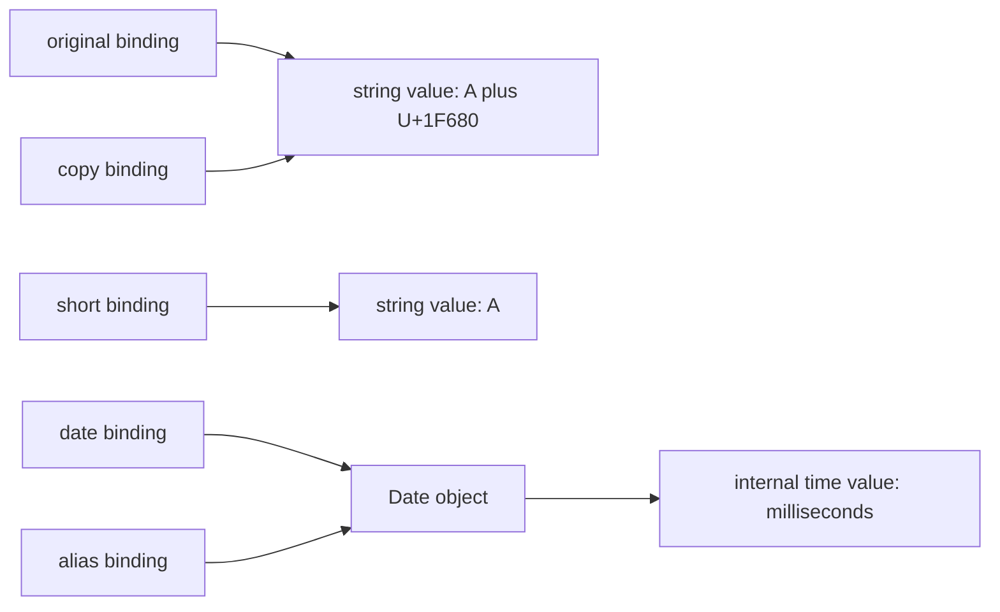
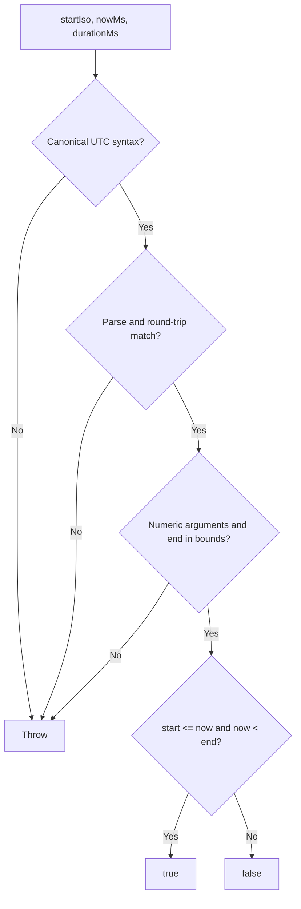

# Strings, Numbers, and Dates: Internal Working

## Value and Reference Model

The diagram is conceptual: it describes observable relationships, not an engine's exact stack layout or string allocation strategy.



Source: `diagrams/volume-1-chapter-05-value-memory.mmd`.

Copying a string value cannot give another binding a way to mutate it. Copying a Date reference does share a mutable object. A fresh Date constructed from the original timestamp separates that state.

```js
const original = 'A\u{1F680}';
const copy = original;
const short = original.slice(0, 1);
const date = new Date('2026-01-01T00:00:00.000Z');
const alias = date;
const snapshot = new Date(date.getTime());

alias.setUTCDate(2);
console.log(copy.length, short);
console.log(date.toISOString());
console.log(snapshot.toISOString());
// Expected output:
// 3 A
// 2026-01-02T00:00:00.000Z
// 2026-01-01T00:00:00.000Z
```

Execution steps:

1. Bind `original` and `copy` to the same string value.
2. Derive the one-code-unit prefix without changing that value.
3. Allocate one Date and bind both `date` and `alias` to it.
4. Allocate a second Date with the copied numeric time value.
5. Mutate the first object's time value; the second keeps its timestamp.

The language permits engines to share immutable string storage or optimize temporary values. Do not infer retention sizes from this picture; measure actual retained memory when that matters.

## Binary Arithmetic Trace

In `0.1 + 0.2`, each literal is first represented as a binary floating-point value. Addition operates on those represented values and rounds the result. Decimal formatting later chooses text to represent that result. A formatting step cannot prove that earlier arithmetic matched the domain's intended decimal policy.

By contrast, the formatter's integer `1299` is exact. The accepted range is deliberately bounded. Division by 100 creates an approximation sufficiently precise for the two-decimal display at that bound; it does not change the integer storage value. Applying tax, splitting amounts, and rounding fractional cents require separate contracts.

## UTC Window Validation Flow



Source: `diagrams/volume-1-chapter-05-utc-window.mmd`.

For start `2026-07-06T10:00:00.000Z`, now at 10:30 UTC, and duration 3,600,000:

| Step | Result | Why it matters |
| --- | --- | --- |
| Check fixed grammar | Accepted | Zone and precision are explicit |
| Parse and round-trip | Same text | Calendar normalization did not change the input |
| Check numeric arguments | Accepted | Addition cannot concatenate a duration string |
| Calculate end | 11:00 UTC | Bounded integer arithmetic |
| Compare | `true` | Start is inclusive; end is exclusive |

At exactly 11:00 the result is false. Adjacent windows can share that boundary without counting it twice. A zero-duration window contains no instants.

## Engine Semantics Versus Optimization

A string method call on a primitive has wrapper-like property access semantics; it does not require a permanent wrapper object to remain allocated. Numeric optimizations must still preserve specified results, including `NaN` and negative zero. Date parsing and international formatting invoke built-in algorithms and runtime data; they are not simple string slicing operations.

For this chapter, correctness depends on the value rules, not on whether an engine uses a compact integer representation, a shared string buffer, or compiled fast paths. Benchmark a real workload before choosing an algorithm based on guessed engine behavior.

See [the production examples](04-production-examples.md) for the complete boundary implementations.
