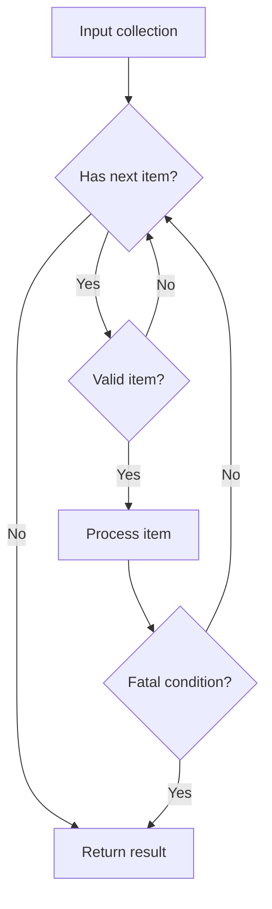
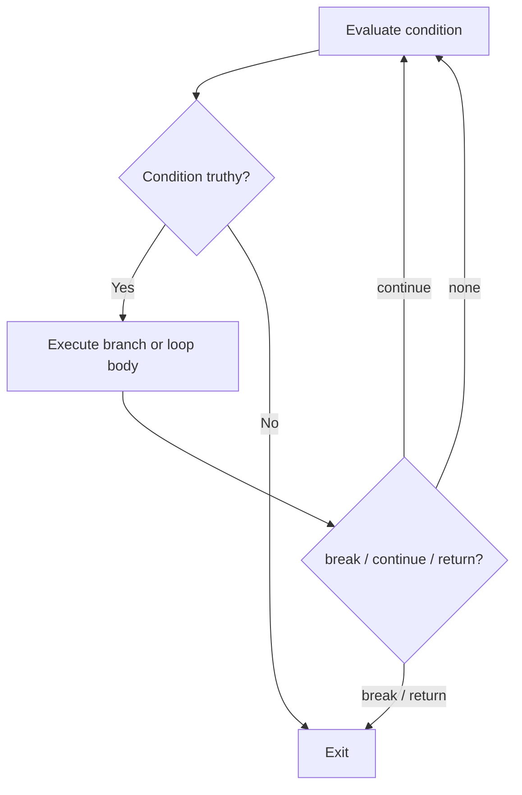

# Internal Working

## Engine-Level View

When JavaScript source reaches an engine, it is parsed into tokens and then into an abstract syntax tree. The engine records scope information, creates internal representations for declarations, and emits bytecode or optimized machine code depending on execution history. The exact pipeline differs between engines, but the observable language rules remain defined by ECMAScript.

Modern engines optimize common paths aggressively. They prefer stable shapes, predictable types, clear control flow, and code that does not force the engine to abandon assumptions. This does not mean you should write unnatural code for the optimizer. It means you should avoid patterns that make correctness and optimization harder at the same time.

## Memory Diagram

## Flowchart

## Execution Steps

1. The host loads a script or module.
2. The engine parses the source and builds scope information.
3. Declarations are registered according to their kind.
4. Top-level code begins executing.
5. Expressions and statements create values, references, and control-flow decisions.
6. Functions create new execution contexts when called.
7. Objects and closures remain reachable while references to them exist.
8. Values with no reachable references become eligible for garbage collection.

## Browser Perspective

Browser control flow must respect responsiveness. Long loops can block rendering and input; large work should be chunked, scheduled, streamed, or moved to a worker.

## Node.js Perspective

Node.js services also run on a single main JavaScript thread. CPU-heavy loops block the event loop and delay every request sharing that process.

## Performance

Most fundamental operations are fast enough for ordinary application code. Performance problems appear when a simple operation is placed inside a hot loop, repeated across large data, or combined with allocation-heavy patterns. Analyze complexity first, then profile. Optimize only the path that measurements identify.

## Security Notes

Security begins at boundaries. Parse and validate external input. Avoid dynamic code execution. Keep secrets out of browser JavaScript. Treat serialization and deserialization as security-sensitive operations. Make failure modes explicit so unsafe values do not drift through the program as if they were trusted.
