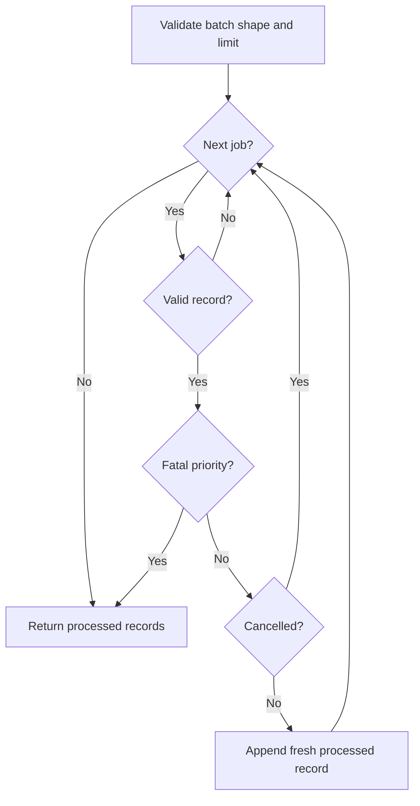
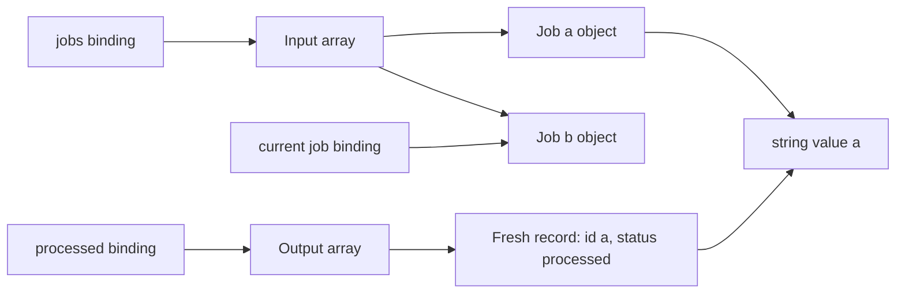

# Control Flow: Internal Working

## From a Policy to a Flowchart


```mermaid
flowchart TD
    A["Validate batch shape and limit"] --> B{"Next job?"}
    B -- No --> R["Return processed records"]
    B -- Yes --> C{"Valid record?"}
    C -- No --> B
    C -- Yes --> D{"Fatal priority?"}
    D -- Yes --> R
    D -- No --> E{"Cancelled?"}
    E -- Yes --> B
    E -- No --> F["Append fresh processed record"]
    F --> B
```

Source: `diagrams/volume-1-chapter-06-job-flow.mmd`.

Validation precedes business decisions. A malformed record that happens to contain `priority: 'fatal'` is skipped under this contract. A valid fatal record stops the batch even if its cancellation flag is true. Reversing those two business checks would implement a different policy.

## Execution Trace

For a batch containing normal a, null, cancelled b, cancelled fatal c, and normal d:

| Visit | Validation | Decision | Output IDs |
| --- | --- | --- | --- |
| a | Valid | Append a fresh result | a |
| null | Invalid | Continue | a |
| b | Valid | Continue because cancelled | a |
| c | Valid | Break because fatal | a |
| d | Not visited | None | a |

No output is produced for a fatal marker. The array returned after the loop is the accumulated prefix result. An empty batch returns an empty output.

## Reference and Accumulator Model


```mermaid
flowchart LR
    A["jobs binding"] --> L["Input array"]
    L --> J1["Job a object"]
    L --> J2["Job b object"]
    V["current job binding"] --> J2
    P["processed binding"] --> O["Output array"]
    O --> R["Fresh record: id a, status processed"]
    J1 --> S["string value a"]
    R --> S
```

Source: `diagrams/volume-1-chapter-06-job-memory.mmd`.

The current loop variable refers to the current input object; the loop does not copy it automatically. The implementation creates a fresh result object and copies the immutable ID string into it. Mutating an output record therefore does not mutate an input job record.

The diagram describes observable ownership. It does not claim a particular engine memory layout or allocation count after optimization.

```js
const input = [{ id: 'a', cancelled: false }];
const output = [];
for (const job of input) {
  output.push({ id: job.id, status: 'processed' });
}
output[0].id = 'changed';
console.log(input[0].id);
console.log(input[0] === output[0]);
// Expected output:
// a
// false
```

## A Classic For Loop's Next Instruction

```js
const trace = [];
for (let index = 0; index < 3; index++) {
  trace.push('visit ' + index);
  if (index === 1) continue;
  trace.push('keep ' + index);
}
console.log(trace.join(' | '));
// Expected output:
// visit 0 | keep 0 | visit 1 | visit 2 | keep 2
```

At index 1, `continue` skips the rest of the body, but the update expression still increments index. At index 3, the test fails and the loop completes. Moving the update into a skipped path of a `while` loop can remove this progress guarantee.

## Iterator and Completion Semantics

Conceptually, `for...of` obtains an iterator, repeatedly requests a step, checks whether it is done, and binds the yielded value for the body. This explains why it works with several collection types without interpreting their property names.

The specification models control transfers using completion records, including normal, break, continue, return, and throw. A construct consumes the completions it handles and lets others propagate. This is a language model, not a requirement that an engine allocate a JavaScript object per statement. [ECMAScript statements and declarations](https://tc39.es/ecma262/multipage/ecmascript-language-statements-and-declarations.html).

On an early exit from `for...of`, iterator closing can invoke an iterator's `return` method. Generators and custom iterators are covered later; the practical rule here is that loop exit can have cleanup semantics, so manually replacing iteration with indexed access is not always equivalent.

## Engine Internals and Cost

An engine can compile branches and loops into different machine instructions while preserving observable evaluation order. A switch does not promise a jump table, and source-level nesting does not prove poor performance.

For n input jobs, the batch performs at most n visits and creates at most n result records: O(n) work and O(n) output space, with constant-sized checks under the bounded ID contract. A fatal record may stop earlier. The output array is the main retained growth; control statements themselves do not produce one output per branch.

Continue with the [production contracts](04-production-examples.md).
