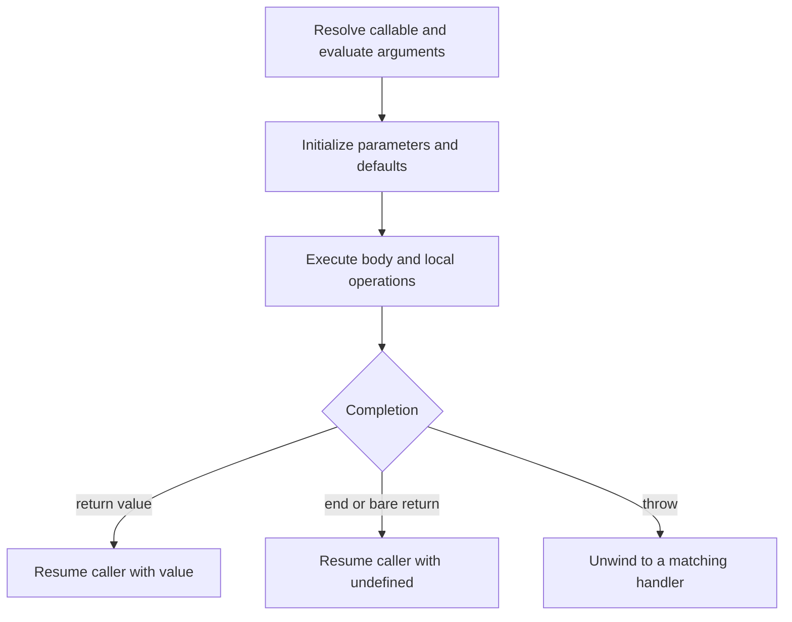
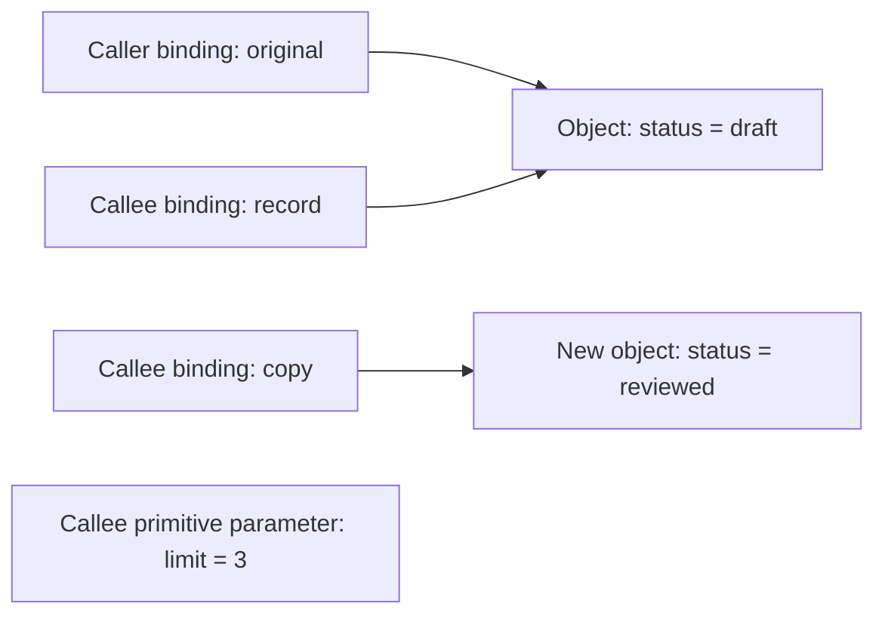

# Internal Working

## Trace a Call From Arguments to Result

```js
'use strict';
const events = [];
function input(value) { events.push(`argument ${value}`); return value; }
function combine(left, right) {
  events.push('body');
  const total = left + right;
  return total;
}
const result = combine(input(2), input(3));
console.log(events.join(' -> '));
console.log(result);
// Expected output:
// argument 2 -> argument 3 -> body
// 5
```

1. Resolve the function value being called.
2. Evaluate the argument expressions in order; their effects occur before this function body starts.
3. Establish this invocation's execution context and initialize its parameters.
4. Execute the body with local bindings `left`, `right`, and `total`.
5. Evaluate the return expression and complete the invocation.
6. Resume the caller with the returned value, here assigning `5` to `result`.

If the first argument evaluation throws, later arguments and the called body do not run. If a default parameter throws, the body also does not run. A callback call follows these same rules; it is not a separate execution mechanism.

## Call Flow



Source: `diagrams/volume-1-chapter-07-call-flow.mmd`. Argument evaluation and parameter initialization can also throw before reaching the body. Exception handling is developed in Chapter 10.

## Bindings and Shared Object Identity



Source: `diagrams/volume-1-chapter-07-argument-memory.mmd`.

The caller and parameter initially refer to one object. Reassigning `record` moves the parameter's reference; it does not move the caller's reference. Mutating the shared object's property changes that object for both observers. Creating `copy` allocates a separate outer object; any nested values copied by reference need their own ownership decision.

These boxes represent language-level bindings and object identity. They do not require primitive values to occupy a physical stack location or every conceptual activation to survive engine optimization.

## Nested Calls and Stack Order

```js
'use strict';
const trace = [];
function inner(value) { trace.push('inner'); return value * 2; }
function outer(value) {
  trace.push('outer starts');
  const result = inner(value);
  trace.push('outer resumes');
  return result + 1;
}
console.log(outer(3));
console.log(trace.join(' | '));
// Expected output:
// 7
// outer starts | inner | outer resumes
```

The inner invocation completes before `outer` continues. Returning from a function removes its active execution from the call stack; it does not guarantee that every value created by that function becomes unreachable. Returned objects and functions can retain data. Volume 2's [closure chapter](../../volume-2/chapter-01/01-introduction.md) explains preserved lexical bindings.

## Engine Internals and Observable Semantics

ECMAScript describes function execution through abstract operations and execution contexts, including parameter initialization and completion records. An engine can inline calls or optimize away temporary storage while preserving observable results, receiver behavior, errors, and effects. [ECMAScript: function declaration instantiation](https://tc39.es/ecma262/#sec-functiondeclarationinstantiation).

Do not claim that arrows always run faster, or count diagram boxes as allocated bytes. Measure the actual workload. Function creation inside a loop can produce distinct function identities; calling a previously created function many times is a different operation. Recursion adds active invocation depth unless the runtime optimizes it, which portable code cannot assume.

## Execution Cost Depends on the Body

A function call is an interface boundary, not a complexity class. A function returning a supplied number does fixed bookkeeping. A function inspecting `n` records performs work determined by that traversal and its callbacks. A callback can allocate, throw, perform I/O, or call back into its caller; include those behaviors in the contract and analysis.

Continue with [Production Examples](04-production-examples.md) to turn this call model into bounded calculations and an explicit synchronous callback interface.
