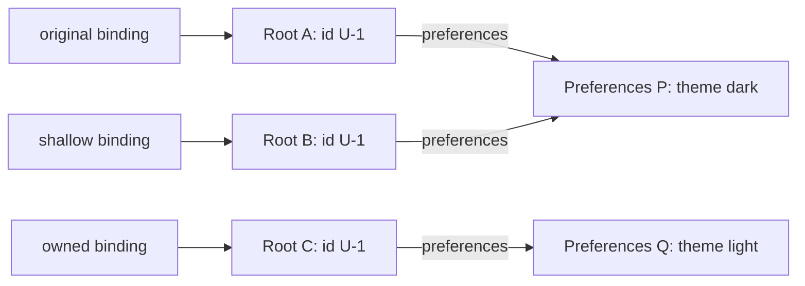
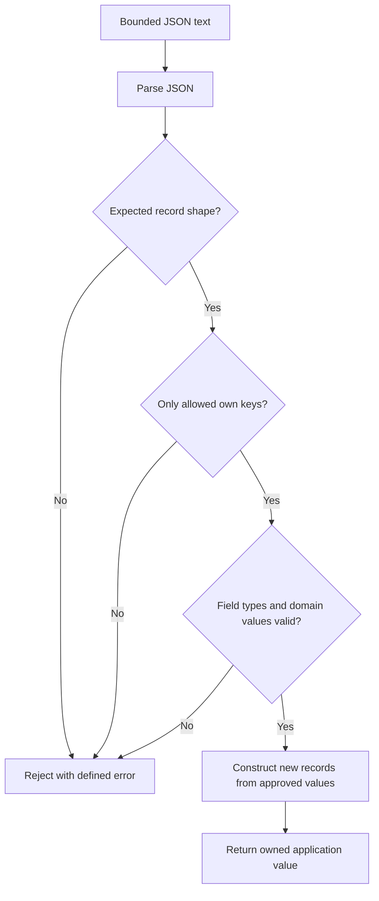

# Internal Working

## Trace an Update Through the Graph

```js
'use strict';

const original = { id: 'U-1', preferences: { theme: 'light' } };
const shallow = { ...original };
const owned = { ...original, preferences: { ...original.preferences } };
shallow.preferences.theme = 'dark';
console.log(original.preferences.theme, owned.preferences.theme);
console.log(original === shallow, original.preferences === shallow.preferences);
console.log(original.preferences === owned.preferences);

// Expected output:
// dark light
// false true
// false
```

1. The first literal creates root object A and nested preference object P.
2. The first spread creates root B. Reading A's preference property supplies P's identity, so B points to P too.
3. The second outer spread creates root C. Its explicit `preferences` entry overrides the initially copied value with new object Q.
4. The nested spread copies P's current theme string into Q.
5. Mutating through B's preference reference changes P. A observes dark; Q still holds light.

## Memory Diagram

The snapshot after the final mutation is:



Source: `diagrams/volume-1-chapter-08-ownership.mmd`. Each arrow denotes a property or binding designating an object identity. The diagram makes no claim about concrete memory addresses or allocation size.

## Safe Boundary Flow



Source: `diagrams/volume-1-chapter-08-record-boundary.mmd`. JSON parsing establishes a data representation, not an application schema. The subsequent checks decide whether that data belongs in the application.

## How a Property Read Differs From an Own Check

For an ordinary data property, an own-property descriptor identifies its stored value. If the property is absent, ordinary lookup can continue through a prototype. An accessor descriptor instead invokes a getter to obtain a value. `Object.hasOwn` checks whether an own descriptor exists without using an inherited method on the record.

This explanation is intentionally about ordinary objects. Proxies can intercept operations, including own-property inspection. A schema that accepts parsed JSON starts from data objects instead of promising effect-free reflection over every possible JavaScript object. Volume 2 covers the underlying object protocols and proxies.

## What Spread Actually Copies

For an object source, spread obtains its own keys, considers enumerable properties, reads their values, and creates data properties on the new target. Reading an accessor gets its current result; it does not copy the getter function as an accessor descriptor. A non-enumerable property is omitted. An object-valued result remains a shared identity.

These steps explain three common observations: a getter can run during spread; a read-only source property can become a writable property in the copy; and nested state can remain shared. Copying descriptors explicitly would be a different operation with a different contract.

## Engine Representation and Cost

Engines may optimize predictable property access with internal shape information and caches, but those implementation choices do not change ownership semantics. V8 describes such choices in its [fast properties article](https://v8.dev/blog/fast-properties). Do not translate that article into a universal rule that adding one field always makes an application slow.

Copying `k` own enumerable properties requires considering those properties and constructing a result. Getter work can add arbitrary cost. A schema-specific copy visits only the records and fields required by its contract. Profile a real workload when allocation or traversal matters; first make the intended sharing visible and correct.
