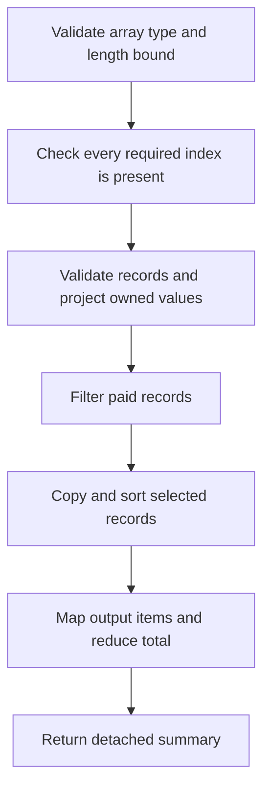
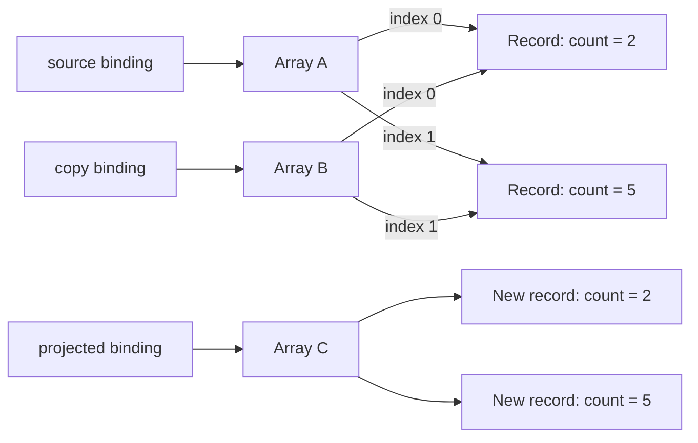

# Internal Working

## A Collection Pipeline Has Separate Stages

The production order summary validates shape and ownership before transformation. It rejects holes, creates normalized records containing only the supported primitive fields, selects paid orders, sorts a copy, and constructs the result.

Stored source: `diagrams/volume-1-chapter-09-pipeline-flow.mmd`.



Validation before filtering matters. If an invalid cancelled order were filtered out first, malformed input could pass unnoticed. The contract rejects an invalid item anywhere in the batch.

## How Map Visits an Array

Conceptually, map obtains the initial length, creates a result array, then considers indices in increasing order. At each index it checks presence, obtains the current value when present, calls the callback, and places the returned value at the corresponding output index. Absent indices remain absent under ordinary prototypes.

The initial length is captured, but future values are not snapshotted. Appending beyond that initial range does not add callbacks; changing a not-yet-visited element can affect what the callback sees.

```js
const input = [1, 2, 3];
const visited = [];
const output = input.map((value, index) => {
  visited.push(value);
  if (index === 0) {
    input[1] = 20;
    input.push(4);
  }
  return value * 2;
});
console.log(visited.join(','));
console.log(output.join(','));
console.log(input.join(','));

// Expected output:
// 1,20,3
// 2,40,6
// 1,20,3,4
```

This demonstrates the rule, not a recommended transformation style. A callback that mutates its input makes reasoning harder; normally keep mapping callbacks pure and place intentional mutation in explicit statements. Callback execution here is synchronous and ordered. Returning promises from map creates an array of promises; it does not automatically wait for them.

## Shallow Copying in Memory

Stored source: `diagrams/volume-1-chapter-09-shallow-memory.mmd`.



Array B has independent index slots, but those slots point to the same records as Array A. Replacing B[0] leaves A[0] alone; changing B[0].count changes the shared record. Array C comes from projecting each primitive count into a new record, so that specific schema is detached.

This is an identity model, not a guarantee of physical engine addresses. Engines may use different storage layouts while preserving aliasing and observable operations.

## A Reduce Trace Has an Accumulator

```js
const trace = [];
const total = [4, 6, 3].reduce((accumulator, value, index) => {
  trace.push(index + ':' + accumulator + '+' + value);
  return accumulator + value;
}, 0);
console.log(trace.join(','));
console.log(total);

// Expected output:
// 0:0+4,1:4+6,2:10+3
// 13
```

The callback's return becomes the next accumulator. Forgetting return supplies undefined to the next call. Without an initial value, the first present element becomes the accumulator and callback iteration starts at the next present index. A fixed initial value makes empty behavior explicit.

An accumulator can be an object or array when that is useful. Mutating a newly created, locally owned accumulator can avoid repeatedly copying its entire contents. Do not mistake every local mutation for mutation of caller-owned input.

## Collection Identity and Equality

A Map stores a key/value association independently from how the key's object fields later change. Changing key.id does not reindex the Map by that property; the key remains the same object identity. If the domain needs lookup by ID text, store the ID text as the key.

```js
const user = { id: 'u1' };
const byObject = new Map([[user, 'active']]);
const byId = new Map([[user.id, 'active']]);
user.id = 'u2';
console.log(byObject.get(user));
console.log(byObject.has({ id: 'u2' }));
console.log(byId.has('u1'), byId.has('u2'));

// Expected output:
// active
// false
// true false
```

The string key is the original primitive value; it does not follow later property changes. The object key retains the object, which also has implications for a long-lived Map's memory usage.

## Engines and Complexity

Engines may specialize arrays based on element kinds and density; those are implementation strategies, not additional language types. Avoid holes and mixed representations when the domain naturally supplies dense homogeneous data, but do not invent correctness rules from a specific engine's optimization.

A scan over n bounded records is O(n). A copying operation usually requires O(n) result storage. Sorting has an implementation-dependent cost; denote it S(n) when making a portable claim. Map/Set access is specified as average sublinear, so an expected constant-time model is a common engineering assumption rather than a universal language guarantee.

The [map algorithm](https://tc39.es/ecma262/multipage/indexed-collections.html#sec-array.prototype.map) describes observable iteration, while [V8's elements kinds article](https://v8.dev/blog/elements-kinds) provides one engine's storage perspective.
