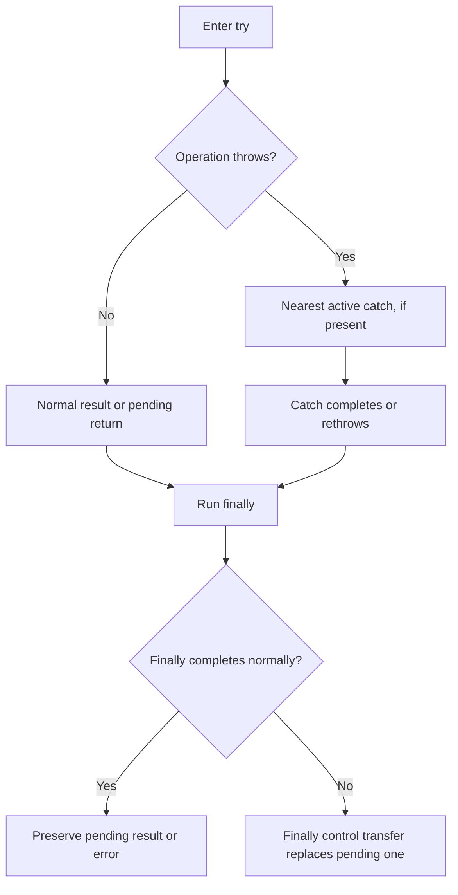
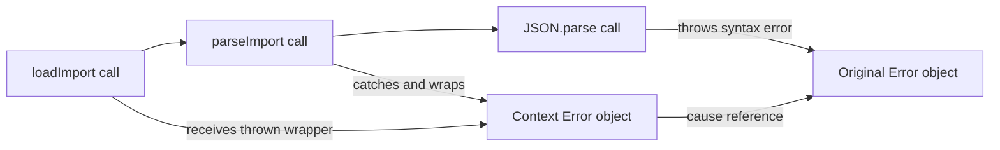

# Errors and Debugging: Internal Working

## The Pending Completion Model



Source: `diagrams/volume-1-chapter-10-error-flow.mmd`.

The diagram describes control flow, not a physical queue of Error objects. Think of a pending completion as "continue normally," "return this value," or "throw this value." Finally gets a chance to execute before that completion leaves the construct.

For a failing operation with a catch and finally:

1. The throw abandons the remaining statements in the protected try.
2. The catch receives the thrown value.
3. The catch either completes normally or creates a new pending completion.
4. Finally runs.
5. Normal cleanup preserves the pending completion; a new transfer replaces it.

## Call Stack and Cause References



Source: `diagrams/volume-1-chapter-10-error-cause.mmd`.

The active calls show where the failure propagates. The cause link shows retained object identity after wrapping. These are different relationships: the original function calls can finish unwinding while the two Error objects remain reachable from a logged or retained failure.

Stack text is a diagnostic view supplied by runtimes; its exact formatting and capture details vary. The language's observable throw/catch behavior does not depend on a portable stack-string format.

## Return Values Are Selected Before Finally

```js
function inspectReturn() {
  let count = 1;
  try {
    return count;
  } finally {
    count = 2;
  }
}
console.log(inspectReturn());
// Expected output:
// 1
```

The return expression produced the primitive value 1 before finally reassigned the local binding. If the pending returned value is an object, finally can still mutate that object through a shared reference:

```js
function inspectObjectReturn() {
  const result = { closed: false };
  try {
    return result;
  } finally {
    result.closed = true;
  }
}
console.log(JSON.stringify(inspectObjectReturn()));
// Expected output:
// {"closed":true}
```

This distinction follows value and reference semantics. A rule such as "finally cannot affect a return value" would be too broad.

## Two Failures Require an Explicit Policy

The resource helper acquires first. Once acquisition returns, use and release belong to one scope. An operation failure is retained even if its thrown value is undefined, so a separate boolean records whether failure occurred.

| Operation | Release | Outcome |
| --- | --- | --- |
| Succeeds | Succeeds | Return operation value |
| Throws | Succeeds | Rethrow the same value |
| Succeeds | Throws | Throw release failure |
| Throws | Throws | Throw AggregateError preserving both |
| Acquisition throws | Not called | Propagate acquisition failure |

Keeping only an error variable and testing its truthiness would lose failures such as `throw undefined`. The companion specifically tests that case.

## Engine Internals and Memory

An implementation may optimize normal execution and create diagnostic information lazily. Do not claim that merely placing code inside try always disables optimization. Measure actual hot paths rather than treating an exception mechanism as a fixed-cost primitive.

Retaining an Error with cause can retain everything reachable from that cause. Avoid attaching a complete request, large buffer, or credential object just to add context. Use a small identifier and carefully selected metadata when it satisfies diagnostic needs.

For the formal control-transfer model, see [ECMAScript completion records](https://tc39.es/ecma262/multipage/ecmascript-data-types-and-values.html#sec-completion-record-specification-type). The [production section](04-production-examples.md) makes the failure matrix executable.
