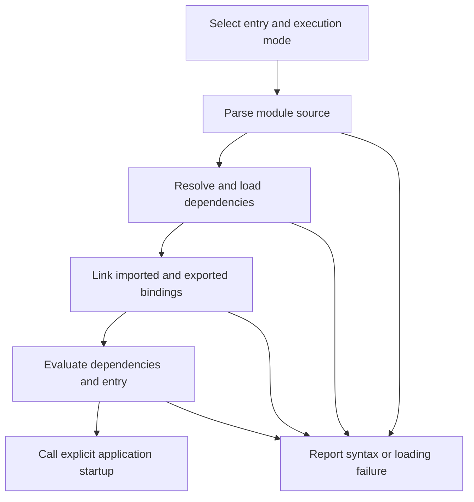
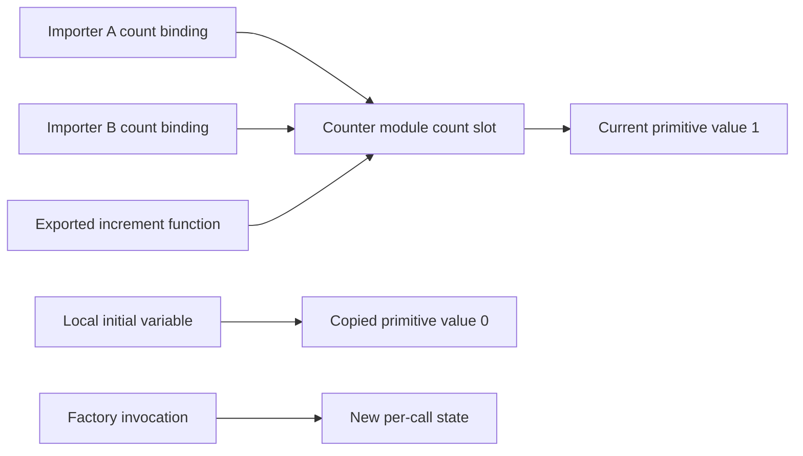

# Internal Working

## A Loader Builds a Graph

The entry file requests a dependency; that dependency can request more dependencies. Before a function call in the entry can use an imported name, the loader must resolve the requested module and connect the requested export. A missing export is different from a function receiving an invalid argument: the application may fail before its entry body begins.



Source: `diagrams/volume-1-chapter-11-module-flow.mmd`. The arrows show conceptual responsibilities, not an engine's exact internal scheduling. Real loaders can interleave discovery and loading. Top-level await adds asynchronous evaluation dependencies.

## Binding Connections and Ordinary Values



Source: `diagrams/volume-1-chapter-11-binding-memory.mmd`. A module environment and its bindings are language-level concepts. This drawing does not require a particular engine to allocate a physical box per arrow.

The counter library has a deliberately shared state contract:

```js
// Runtime: Node.js ES module
export let count = 0;
export function increment() {
  count += 1;
  return count;
}
// Expected output:
// (none)
```

Save it as `counter.mjs` to reproduce the theory's live-binding program. The repository already contains that file. No increment happens merely because the function is declared. This teaching counter has no persistence or concurrency contract; its assertions run in a fresh process.

## Execution Trace

1. Node selects ESM for `example-00-module-model.mjs`.
2. The loader resolves `./counter.mjs` beside the entry and connects the named exports.
3. Evaluation initializes count to zero and creates the function value.
4. The entry saves the current primitive in a local variable.
5. Calling increment assigns a new number to the exported binding.
6. Reading count through the import sees one; reading the saved local still sees zero.
7. Importing the same resolved counter again returns a namespace connected to the same module instance in this process.

A fresh Node process creates a fresh loader context and count starts at zero again. Module caching is neither disk persistence nor shared memory across processes.

## Scope, Lifetime, and Engine Work

An unexported helper can still be retained because an exported function uses it. Removing a local variable in an importer does not imply that a module or its resources are unloaded. Module caches, active functions, and other references affect reachability. Do not use dynamic import as an automatic memory release strategy.

The engine parses and executes JavaScript; the host supplies module resolution, filesystem access, and other facilities. Optimization may inline calls, but it must preserve observable behavior. Moving code into another file does not by itself make it faster, asynchronous, or isolated.

## Cycles and Initialization

Consider a dependency diagram A -> B -> A. The names can be linked without all their values being initialized. If B's top-level initializer immediately reads an uninitialized exported constant from A, evaluation throws. If the read occurs later inside a function after both modules have finished initializing, that particular early-read failure may disappear. This is a timing distinction, not a reason to add cycles indiscriminately.

Further reading: [ECMAScript module records](https://tc39.es/ecma262/#sec-abstract-module-records) and [cyclic module records](https://tc39.es/ecma262/#sec-cyclic-module-records). Use the specification to distinguish binding creation, initialization, and evaluation; host-specific path lookup comes from the runtime documentation.
