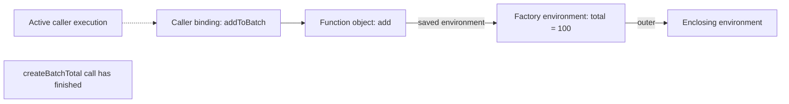
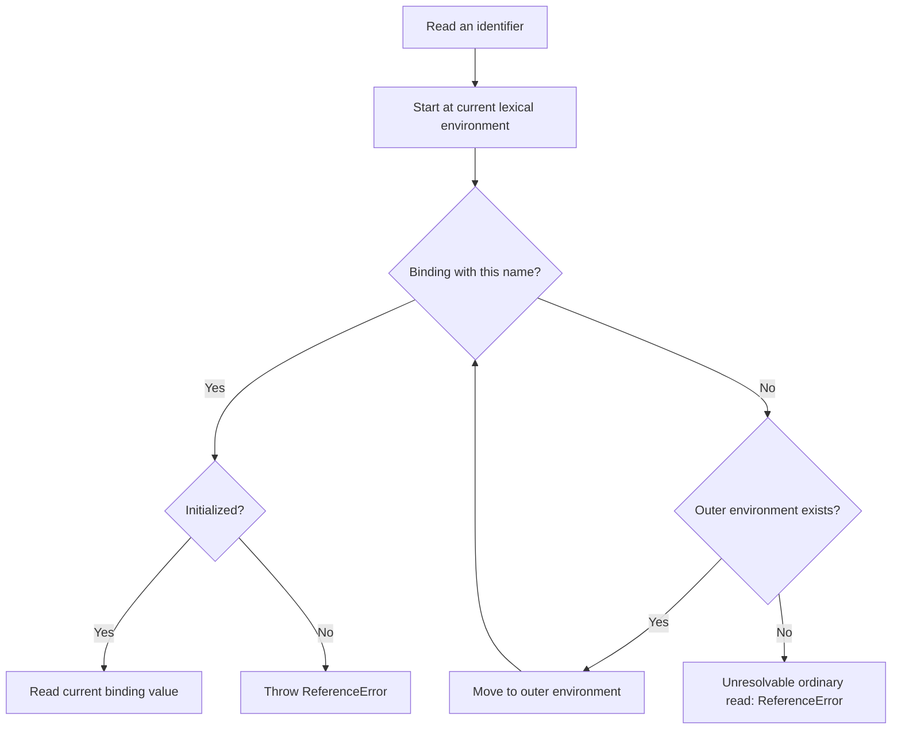

# Internal Working

## The Specification Model

An Environment Record associates names with bindings and links to an outer environment. For a name read, identifier resolution checks the current environment and then outer environments until it finds the binding or reaches the end. An uninitialized lexical binding fails when read. Environment Records are specification machinery, not JavaScript objects you can enumerate. [ECMAScript Environment Records and identifier resolution](https://tc39.es/ecma262/multipage/executable-code-and-execution-contexts.html#sec-environment-records).

An ordinary ECMAScript function has an internal `[[Environment]]` slot that refers to the environment supplied during creation. Calling it creates a function environment whose outer environment comes from that saved reference. This is why the caller's local variables do not replace the function's enclosing bindings. Double brackets identify specification slots; writing `fn.Environment` does not expose them. [ECMAScript function creation and calls](https://tc39.es/ecma262/multipage/ordinary-and-exotic-objects-behaviours.html#sec-ordinaryfunctioncreate).

## Trace One Factory Call

The following example uses a running batch total. Inputs are trusted small integers so we can focus on scope rather than numeric validation.

```js
'use strict';

function createBatchTotal(initial) {
  let total = initial;

  return function add(amount) {
    total += amount;
    return total;
  };
}

const addToBatch = createBatchTotal(100);
console.log(addToBatch(25));
console.log(addToBatch(10));
// Expected output:
// 125
// 135
```

Follow the operations in this order:

1. `createBatchTotal(100)` begins an invocation with an `initial` parameter equal to `100`.
2. Evaluating `let total = initial` initializes this invocation's `total` binding to `100`.
3. Evaluating the function expression creates `add` with access to the surrounding environment.
4. The factory returns that function. The caller assigns it to `addToBatch`, and the factory call finishes.
5. `addToBatch(25)` begins a new invocation of `add`, with its own `amount` parameter equal to `25`.
6. `total += amount` reads the retained `total` binding and the current call's `amount`, adds them, and writes `125` to `total`.
7. That call returns `125` and finishes. The binding needed by future calls remains available.
8. The next call has a new `amount` binding equal to `10`; it updates the same `total` binding to `135`.

The addition is constant work per call. Retained state is constant in this example. These costs describe the algorithm; they do not claim a particular byte count or machine instruction sequence.

## Memory Diagram: After the Factory Returns



Diagram source: `diagrams/volume-2-chapter-01-closure-memory.mmd`.

The arrows show a conceptual route to the binding used by `add`. The finished factory call is deliberately disconnected: its execution does not remain active. The diagram omits unrelated bindings and does not assert that an engine retains every local variable, the original stack frame, or exactly one heap object for each box.

When `add` runs, it has a current call context. The persistent state it uses is a separate lifetime concern. Confusing these two ideas leads to the incorrect explanation that a closure keeps its parent function running forever.

## Flowchart: Resolving a Name Read



Diagram source: `diagrams/volume-2-chapter-01-name-resolution.mmd`.

This chart is a teaching model for ordinary identifier reads in these examples. Property access, assignment, `typeof` on an unresolvable name, and dynamic constructs have additional rules. In particular, looking up `config.route` first resolves the binding `config`, then accesses a property of its value; `route` is not another scope-chain lookup.

In the batch example, `amount` is found in the current `add` call. `total` is found in the enclosing factory environment. Searching the currently active caller for another variable named `total` would follow the wrong chain.

## One Invocation, Several Functions

When a factory returns both `read` and `advance`, both functions created during that invocation can reach its state. Reassigning that state through one function changes what the other reads. A second factory invocation creates separate local bindings, even if its initial values happen to be equal.

To draw this variation, add two function boxes pointing to the same state box. To represent a second factory call, add a second state box and another pair of functions. Merely duplicating a function reference, such as assigning an existing callback to another variable, does not call the factory again and does not create fresh state.

## Engine Internals: What V8 Adds

V8's implementation documentation distinguishes `Scope`, used during parsing and analysis, from `ScopeInfo`, metadata retained for execution and debugging, and `Context`, which holds context-allocated variable values. Its closure example stores captured state in a heap context referenced by the returned function, allowing the factory's stack frame to end. [V8: Scopes and ScopeInfos](https://chromium.googlesource.com/v8/v8/+/main/docs/runtime/scopes-and-scope-infos.md).

This gives a concrete implementation model for the example, not a requirement that every engine allocate identical structures. Optimizations can change storage while preserving observable behavior. Do not infer an exact memory cost from an environment diagram, and do not promise that a local will be visible in a debugger just because it appeared in source code.

For interviews, establish which binding changes and why the output follows. Introduce implementation structures only when explaining how an engine can support that behavior. A correct language explanation should survive changes in V8's optimizer.

## Reachability and Lifetime

Suppose a long-lived registry stores `addToBatch`. The registry can continue to invoke the function, so the state needed for those invocations must remain available. Removing one reference helps only if no other owner still reaches the function or its state.

This observation suggests a practical design question: which component owns registration, and when does it release the callback? The [subscription example](04-production-examples.md) returns an unsubscribe function so that lifetime decision has an explicit API.

Unreachable state may become collectible, but closure representation and garbage collection details vary by implementation; a lexical diagram is not an exact retained-heap measurement. V8 also documents how shared closure environments can complicate retention in its [discussion of weak references](https://v8.dev/features/weak-references). Use retaining paths in a memory profile when investigating an actual leak, and use explicit cleanup for resources that must be released predictably.

Continue with [Production Examples](04-production-examples.md) to apply these ideas to request ownership and subscriptions.
