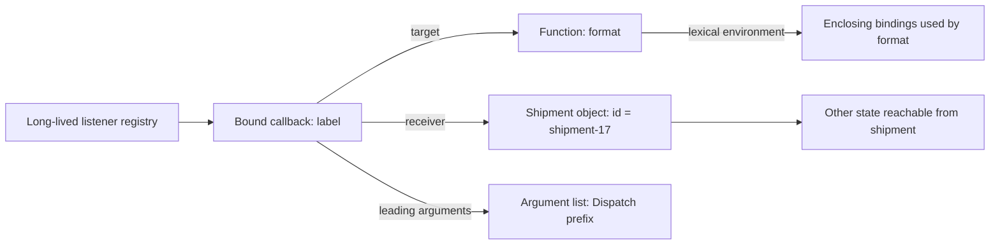
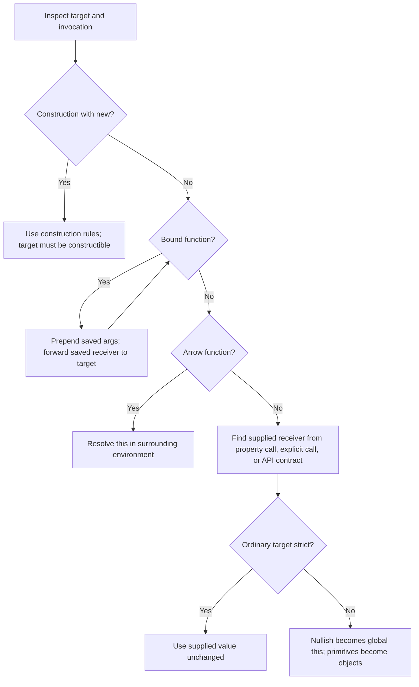

# Internal Working

## Three Values to Track

For a normal call, write down the target function, the supplied receiver, and the argument list separately. This makes it easier to distinguish finding a function from invoking it. The expression `shipment.format('ready')` first obtains a method through a property reference, then invokes it with a receiver and arguments.

Consider one bound call:

```js
'use strict';

function format(prefix, status) {
  return `${prefix}${this.id}: ${status}`;
}

const shipment = { id: 'shipment-17' };
const label = format.bind(shipment, 'Dispatch ');
console.log(label('ready'));
// Expected output:
// Dispatch shipment-17: ready
```

Trace its execution:

1. Evaluating `format.bind` finds the binding operation inherited from `Function.prototype`.
2. Calling it supplies `format` as the binding operation's own receiver, and `shipment` and `'Dispatch '` as its arguments.
3. Binding produces a new function that retains the target, the intended receiver, and the leading argument. The body of `format` has not run.
4. Calling `label('ready')` invokes that bound function.
5. Its call operation assembles the target arguments in order: `'Dispatch '`, then `'ready'`.
6. It invokes `format` using the stored `shipment` receiver.
7. The strict target uses that receiver unchanged. Reading `this.id` reads the object's current property.
8. The string result returns through the bound function to `console.log`. A thrown error would also propagate through the call.

Notice the two distinct receivers in step 2 and step 6. `format` is the receiver of the operation named `bind`; `shipment` becomes the receiver of the eventual call to `format`.

## Specification Slots and Environments

Ordinary ECMAScript functions have a `[[ThisMode]]`: lexical for arrows, strict for strict ordinary functions, or global for non-strict ordinary functions. A normal function call establishes a function environment; strict calls use the supplied receiver unchanged, while global-mode calls perform the conversions discussed in [Theory](02-theory.md). Lexical mode introduces no own `this` binding.

Bound functions are specified separately with `[[BoundTargetFunction]]`, `[[BoundThis]]`, and `[[BoundArguments]]`. Their call operation forwards to the saved target. These names describe internal slots, not properties such as `label.BoundThis`. [ECMAScript: ordinary and bound function behavior](https://tc39.es/ecma262/multipage/ordinary-and-exotic-objects-behaviours.html#sec-bound-function-exotic-objects).

The target's lexical environment and its call receiver remain distinct. Binding `format` does not change where its free identifiers are resolved. If it also refers to a surrounding `currency` binding, that lookup continues to follow the environment where `format` was created.

## Memory Diagram: A Registered Bound Callback



Diagram source: `diagrams/volume-2-chapter-02-bound-function-memory.mmd`.

This is a reachability model. It does not specify heap addresses, object sizes, or whether an optimizer eliminates a temporary allocation. Retaining the callback can keep its receiver and the receiver's reachable state available for later calls. Binding one small method can therefore retain a much larger object graph.

Removing a listener removes that registry's reference. A stored callback elsewhere can still retain the same owner. Conversely, an instance that points to a bound method which points back to that instance does not automatically leak: a cycle that is unreachable from live roots may be collected. Cleanup controls registration and resource lifetime; it does not guarantee immediate garbage collection.

## Flowchart: Determine the Call's Receiver



Diagram source: `diagrams/volume-2-chapter-02-receiver-selection.mmd`.

The loop means to continue with the saved **target**, not repeatedly inspect the same bound wrapper. A chain of bound functions eventually reaches its callable target. If that target is an arrow, the supplied receiver does not replace lexical `this`.

This chart covers ordinary functions, arrows, and bound functions used here. Built-ins and callable proxies have their own internal behavior. A `Map` method, for example, can reject a supplied receiver that lacks the required internal state. For a plain call to one of our ordinary functions, the supplied value is `undefined` before strict or non-strict handling.

## Why Detachment Changes a Call

For `shipment.format()`, expression evaluation carries the base object into the call. For `const format = shipment.format; format()`, the assignment retrieves a function value and the later identifier call does not carry the original base. The function body and identity may be unchanged, but the receiver input differs. [ECMAScript: EvaluateCall](https://tc39.es/ecma262/multipage/ecmascript-language-expressions.html#sec-evaluatecall).

This distinction also explains why storing a callback does not itself bind it. A library can later call a local callback variable, a property of a registration record, or `Reflect.apply(callback, receiver, args)`. Read the library's contract or implementation to determine which receiver is supplied.

## Why an Arrow Survives Detachment

An arrow defined inside `shipment.makeReader()` uses that invocation's surrounding `this` binding. Returning the arrow does not require the method to remain on the active stack. The environment needed by the arrow remains available, just as captured bindings did in the closure chapter.

If `makeReader` is called again with a different receiver, it can create another arrow using that invocation's receiver. Reusing the first arrow never recreates its environment. This makes a factory method an explicit place to decide which owner a callback belongs to.

## Construction Through a Bound Function

Native bound functions forward construction only if the target supports it. Bound leading arguments are retained, but the stored receiver is not used for the new instance. When the bound function itself is the construction target, forwarding adjusts `new.target` to the saved target.

```js
'use strict';

function Shipment(id) {
  this.id = id;
  this.directTarget = new.target === Shipment;
}

const PreparedShipment = Shipment.bind({ id: 'unused' }, 'shipment-17');
const shipment = new PreparedShipment();
console.log(shipment.id);
console.log(shipment.directTarget);
// Expected output:
// shipment-17
// true
```

The example uses an ordinary base constructor and a direct `new PreparedShipment()` call. Advanced `Reflect.construct` calls can supply a different `newTarget`; derived constructors also have additional initialization rules. The general construction algorithm is more precise than a fixed ranking of "new beats bind."

## Engine Internals: A Concrete V8 Representation

V8's `JSBoundFunction` definition contains fields for a target function, a bound receiver, and bound arguments. This is a concrete implementation counterpart to the retention diagram. The source also distinguishes bound functions from ordinary `JSFunction` objects. [V8: function object definitions](https://github.com/v8/v8/blob/main/src/objects/js-function.tq).

Those fields are useful for understanding what must be preserved; they do not establish a performance ranking. Engines can specialize calls or optimize allocations when observable behavior is unchanged. Actual memory use depends on the runtime, retained data, and optimization state. Measure the application and inspect retaining paths when callback retention is a problem.

The specification describes results that every conforming engine must produce. Engine structures explain one implementation. Keep the two levels separate in interviews: establish the receiver and output first, then discuss implementation only as needed.

## Execution Cost and Lifetime

In the tracing example, the argument counts and stored state are fixed. A general forwarding wrapper that assembles `k` leading arguments and `n` current arguments performs O(k + n) argument assembly in a straightforward implementation, plus the target's work. It retains O(k) argument references and one receiver reference. The object graph reachable through any one reference can be much larger.

ECMAScript does not promise an exact time or byte cost for native `bind`, `call`, or `apply`. In particular, reading argument-list properties may execute getters. Complexity statements about our own array-building wrappers assume ordinary trusted arrays and count argument assembly separately from the target body.

Continue with [Production Examples](04-production-examples.md) for a callback with explicit lifecycle ownership and a wrapper that preserves its caller's receiver.
