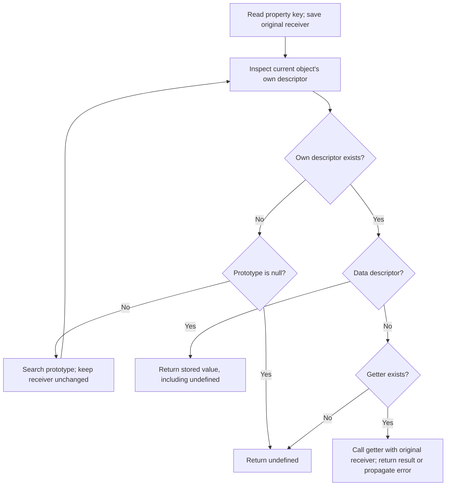
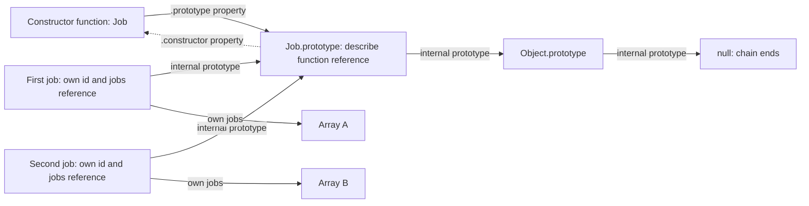

# Internal Working

## Follow the Search Object and Preserve the Receiver

A prototype read has two roles that often begin with the same object: the object currently being searched and the receiver used by an accessor. When lookup climbs the chain, the search object changes. The original receiver is preserved.

```js
'use strict';

const jobBehavior = {
  get label() { return `${this.id}: ${this.status}`; }
};
const job = Object.assign(Object.create(jobBehavior), {
  id: 'job-17', status: 'queued'
});

console.log(job.label);
console.log(Reflect.get(jobBehavior, 'label', { id: 'job-18', status: 'running' }));
// Expected output:
// job-17: queued
// job-18: running
```

Trace `job.label`:

1. The expression identifies `job` as both the initial search object and the receiver.
2. `job` has own `id` and `status` properties but no own `label` descriptor.
3. Its prototype is `jobBehavior`, so lookup continues there with the receiver still equal to `job`.
4. `jobBehavior` has an accessor descriptor for `label` with a getter.
5. The getter executes with `job` as `this`.
6. Its reads of `this.id` and `this.status` start new property lookups on `job`, both satisfied by own data properties.
7. The resulting string becomes the value of `job.label`.

The explicit `Reflect.get` call starts directly at the prototype but chooses another receiver. Its result is evidence that the getter's storage location does not decide its `this`.

## The Specification Model

Ordinary objects implement internal operations such as `[[GetOwnProperty]]`, `[[GetPrototypeOf]]`, `[[Get]]`, and `[[Set]]`. Double brackets identify specification machinery, not JavaScript properties that an application can access by name.

An ordinary read checks for an own descriptor. If absent, it delegates to the prototype with the receiver unchanged. A data descriptor supplies its value. An accessor descriptor supplies a getter to call, or `undefined` when no getter exists. If the chain ends first, the read also returns `undefined`. These two causes of an undefined value must be distinguished through ownership or descriptor inspection. [ECMAScript: OrdinaryGet](https://tc39.es/ecma262/multipage/ordinary-and-exotic-objects-behaviours.html#sec-ordinaryget).

This is a semantic model. Proxies and exotic objects may implement internal operations differently. A descriptor-inspection utility can avoid ordinary getters, but cannot promise no side effects when arbitrary proxies are allowed.

## Flowchart: An Ordinary Property Read



Diagram source: `diagrams/volume-2-chapter-03-property-lookup.mmd`.

The search stops on the first descriptor. The flowchart does not evaluate truthiness and does not fall through when a property stores `undefined`. It describes property reading; method invocation and assignment add their own operations.

## Memory Diagram: Two Instances and One Shared Prototype



Diagram source: `diagrams/volume-2-chapter-03-prototype-memory.mmd`.

The two arrays are separate objects. Both instances find the shared method on one prototype. The dotted arrow is a normal `constructor` property, not the link followed during property lookup. The constructor function also has its own internal prototype chain, omitted here to keep the instance relationships readable.

The boxes are a conceptual reference graph, not a literal heap layout. They do not assert a specific object size or require an engine to represent every step as a pointer chase at runtime.

## Trace Construction Separately From Lookup

```js
'use strict';

function Job(id) {
  this.id = id;
  this.jobs = [];
}
Job.prototype.describe = function () { return `${this.id}: ${this.jobs.length}`; };

const first = new Job('job-17');
const second = new Job('job-18');
first.jobs.push('export');
console.log(first.describe());
console.log(second.describe());
console.log(first.describe === second.describe);
// Expected output:
// job-17: 1
// job-18: 0
// true
```

For each direct construction, the ordinary base constructor's instance links to the current `Job.prototype`. The constructor body then writes an own `id` and allocates a fresh array for its own `jobs` property. The body does not create `describe`; that function was assigned to the shared prototype before either construction.

When `first.describe()` executes, lookup reaches the prototype, then the call supplies `first`. The method's `this.jobs` read therefore reaches Array A. A second method call through `second` reaches Array B. Both have constant-size reference bookkeeping here; retained array contents grow with queued entries, and string-result construction depends on output length.

If the constructor's `.prototype` property is later replaced, this graph must show a new prototype box for new instances. Moving the constructor's property arrow does not move the existing instances' internal prototype arrows.

## Assignment Has a Separate Path

For an ordinary `child.count = 3`, finding an inherited writable data descriptor can lead to defining an own property on `child`. Finding an inherited setter instead invokes that setter with the child receiver. A non-writable data property, missing setter, or incompatible receiver property can reject the operation. Extensibility also matters when a new own property is needed.

This distinction explains why `child.items.push(value)` is not a request to create `child.items`: it first reads `items`, then calls `push` on the array it found. If that array belongs to a shared prototype, its contents change for every descendant that still finds the same array.

Similarly, `Object.defineProperty(child, key, descriptor)` requests an own definition directly. Its result is governed by the child's extensibility and existing own descriptor, rather than by treating an inherited non-writable property as a universal prohibition. [ECMAScript: OrdinarySetWithOwnDescriptor](https://tc39.es/ecma262/multipage/ordinary-and-exotic-objects-behaviours.html#sec-ordinarysetwithowndescriptor).

## Engine Internals: Prototypes and V8 Shapes

V8 uses internal shape metadata called Maps, also commonly discussed as HiddenClasses, to describe object structure. This metadata is distinct from both JavaScript's `Map` collection and an object's language-level prototype. Two objects can have the same prototype and different own property layouts.

V8's property-storage explanation describes shape transitions as properties are added, shared metadata for compatible layouts, and fast versus dictionary-style property storage. These mechanisms help an engine avoid treating every property operation as an unoptimized search. [V8: Fast properties](https://v8.dev/blog/fast-properties).

A source-level chain diagram establishes observable semantics. It does not establish a fixed lookup cost, a guaranteed optimization tier, or a reason to rewrite a clear design. Stable initialization and stable prototype relationships can help engines maintain assumptions, but actual behavior depends on the runtime and workload. Measure creation, access, and retained memory before choosing a representation for speed.

## Complexity and Reachability

For a teaching algorithm that explicitly visits a chain of depth `d`, one key lookup involves at most O(d) prototype levels, excluding getters and proxy behavior. This counts visited objects and assumes bounded work for the own-property check. Actual engine property access may use caches and guards instead of literally walking every level.

For `n` instances sharing `m` prototype methods, the conceptual model has `m` shared function values and each instance's own state. Allocating a fresh method closure for every instance can instead create O(nm) function identities. These counts are not byte estimates and do not imply that every closure is a bad design; captured state can be an intentional part of an API.

A live instance can keep its prototype and reachable shared values alive. Sharing a prototype with a large mutable cache also shares that cache's ownership. A constructor/prototype cycle is not inherently a leak; reachability from active owners determines what remains collectible. The [performance notes](10-performance-security.md) turn these observations into measurement and lifecycle questions.

Continue with [Production Examples](04-production-examples.md) for shared behavior with explicit per-record state and a data boundary that does not trust inherited options.
