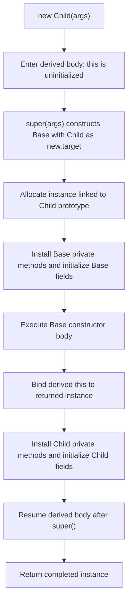
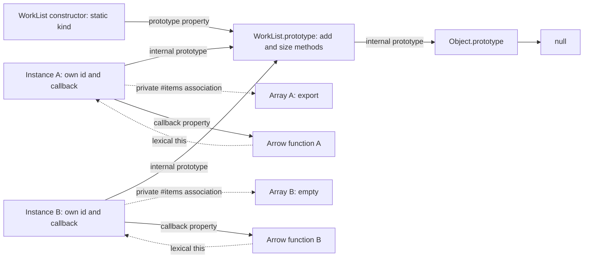

# Internal Working

## Separate Definition from Construction

Evaluating a class creates its constructor, prototype, methods, private names, and initialization instructions. It does not immediately evaluate every instance field initializer. Static initialization belongs to class evaluation; instance initialization belongs to each construction.

Computed member names are evaluated during definition, including names of instance fields. The corresponding instance values are evaluated later for each instance. This distinction matters when a name expression has a side effect or reads changing configuration.

```js
'use strict';

const events = [];
class Report {
  static version = (events.push('static field'), 1);
  [(events.push('computed key'), 'state')] =
    (events.push('instance field'), 'ready');
  static { events.push('static block'); }
  constructor() { events.push('constructor body'); }
}

console.log(events.join(' | '));
events.length = 0;
const first = new Report();
const second = new Report();
console.log(events.join(' | '));
console.log(first.state, second.state);
// Expected output:
// computed key | static field | static block
// instance field | constructor body | instance field | constructor body
// ready ready
```

The computed key is established while processing the class elements, before static field values and blocks execute. It remains `state` for both objects. Each construction separately evaluates the instance initializer. The constructor body then sees that initialized field. The language's [class definition evaluation algorithm](https://tc39.es/ecma262/multipage/ecmascript-language-functions-and-classes.html#sec-runtime-semantics-classdefinitionevaluation) specifies these phases.

## The Instance Initialization Operation

The specification models a constructor's instance fields as ordered records of names and initializers. `InitializeInstanceElements` installs private methods and accessors first, then defines the fields in order. `DefineField` evaluates an initializer with the receiving object as `this`; it then adds a private field or defines a public data property. These are abstract operations, not callable JavaScript APIs. [ECMAScript: InitializeInstanceElements and DefineField](https://tc39.es/ecma262/multipage/abstract-operations.html#sec-initializeinstanceelements).

This order explains a useful asymmetry:

```js
'use strict';

class Label {
  text = this.#prefix();
  #prefix() { return 'report'; }
}
class PublicForwardRead {
  first = this.second;
  second = 2;
}
class PrivateForwardRead {
  first = this.#second;
  #second = 2;
}

console.log(new Label().text);
const record = new PublicForwardRead();
console.log(record.first, record.second);
try {
  new PrivateForwardRead();
} catch (error) {
  console.log(error.name);
}
// Expected output:
// report
// undefined 2
// TypeError
```

The private method is available to the earlier initializer. The later public field is not yet an own property; here there is no inherited `second`, so its read produces `undefined`. The later private field is absent, so access throws. A private method available early can still fail if its body reads a private field that has not yet been initialized.

## Flowchart: Ordinary Derived Construction

The following flow applies to an ordinary base/derived pair with one successful `super()` call and no replacement object returned by either constructor. The [edge cases](09-edge-cases-debugging.md) cover return overriding.



Diagram source: `diagrams/volume-2-chapter-04-construction-flow.mmd`.

Each initializer or body can throw. The error interrupts construction; earlier mutations or external effects are not undone. A successful private-element check also does not establish that later initializers or constructor checks finished.

The allocation already uses `Child.prototype` because `new.target` remains `Child` through ordinary `super()` construction. There is one instance with both sets of initialized state, not a base object nested inside a child object.

## Execution Steps: An Override Runs Too Early

```js
'use strict';

const events = [];
class BaseTask {
  constructor() {
    events.push(`base new.target: ${new.target.name}`);
    events.push(`override reads: ${this.describe()}`);
  }
  describe() { return 'base'; }
}
class ExportTask extends BaseTask {
  format = 'csv';
  describe() { return this.format; }
}

const task = new ExportTask();
console.log(events.join(' | '));
console.log(task.describe());
console.log(Object.getPrototypeOf(task) === ExportTask.prototype);
// Expected output:
// base new.target: ExportTask | override reads: undefined
// csv
// true
```

Trace the construction:

1. `new ExportTask()` invokes the default derived constructor, which forwards to the base constructor.
2. Ordinary allocation creates an object whose prototype is `ExportTask.prototype`.
3. The base constructor starts. No derived field initializer has run yet.
4. `this.describe` resolves to `ExportTask.prototype.describe` through ordinary lookup.
5. The property call preserves the new object as the receiver.
6. The override reads `format`, which is absent at this point.
7. Base construction finishes. The derived field initializer creates the own `format` property.
8. The caller receives the object. A later `describe()` call now reads `csv`.

The remedy is a lifecycle design change, not an extra existence test in every override. Let the base constructor accept the values it needs. If initialization requires collaboration after construction, use an explicit creation operation that controls when a completed object becomes visible.

## Memory Diagram: Shared Methods and Instance-Owned State

```js
'use strict';

class WorkList {
  static kind = 'work-list';
  #items = [];
  constructor(id) { this.id = id; }
  add(item) { this.#items.push(item); }
  size() { return this.#items.length; }
  callback = () => this.size();
}

const first = new WorkList('A');
const second = new WorkList('B');
first.add('export');
console.log(first.size(), second.size());
console.log(first.size === second.size);
console.log(first.callback === second.callback);
console.log(Object.keys(first).join(','));
// Expected output:
// 1 0
// true
// false
// callback,id
```



Diagram source: `diagrams/volume-2-chapter-04-class-memory.mmd`.

These boxes model reachability and identity, not a required physical heap layout. Private associations are deliberately different from ordinary public property arrows. There is no enumerable `"#items"` property that a caller can discover to access either array.

The arrow functions have distinct identities and retain their instance receiver when stored externally. Removing all ordinary variables pointing to Instance A does not make it collectible if an active listener registry still holds Arrow A. An internal cycle alone is not a leak; reachability from live roots is what matters.

With `n` instances and `m` prototype methods, there are conceptually `m` shared method function values for that class definition. Making all `m` methods arrow fields instead creates up to `n × m` distinct function values. This comparison concerns allocation identities, not byte counts or a universal speed ranking. Copying `k` entries into owned state requires O(k) work and storage in the simple array model; construction is not inherently O(1).

## Private Access Uses Identity, Not Delegation

An expression such as `this.#items` resolves the private name lexically, then checks the receiving object for that private element. It does not search the receiver's prototype. This is why borrowing a method onto a lookalike object fails even if every public field matches.

A proxy is a separate receiving object. With an empty handler, property lookup can find the target's public method, but `proxy.method()` supplies the proxy as `this`. That receiver usually lacks the target's private elements. The [debugging section](09-edge-cases-debugging.md) demonstrates the failure and explains when an explicit adapter is appropriate. The operation is specified by [PrivateGet](https://tc39.es/ecma262/multipage/abstract-operations.html#sec-privateget).

## Engine Internals: Observable Rules and Optimized Storage

The specification describes private elements and field-definition operations abstractly. An engine may encode them differently as long as observable behavior remains correct. V8's published account of class-feature optimization describes internal private symbols, generated initializer code, and inline caches for field initialization. These internal symbols are not application-visible `Symbol` keys. [V8: Faster initialization of instances with new class features](https://v8.dev/blog/faster-class-features).

That article documents changes in particular V8 releases, including optimizations introduced around V8 9.7. It is implementation history, not a claim that every current engine uses identical bytecode or that private fields always outperform closures. Treat internal names as a way to understand optimization opportunities, not a stable interface.

For a production investigation, measure creation rate, repeated method calls, retained instances, and callback lifetime separately. Warm-up, garbage collection, retained data, and the target runtime can dominate differences between syntactic forms. The [performance notes](10-performance-security.md) give a concrete measurement procedure.

Continue with [Production Examples](04-production-examples.md) to apply construction rules to a reservation object and a composed notification capability.
